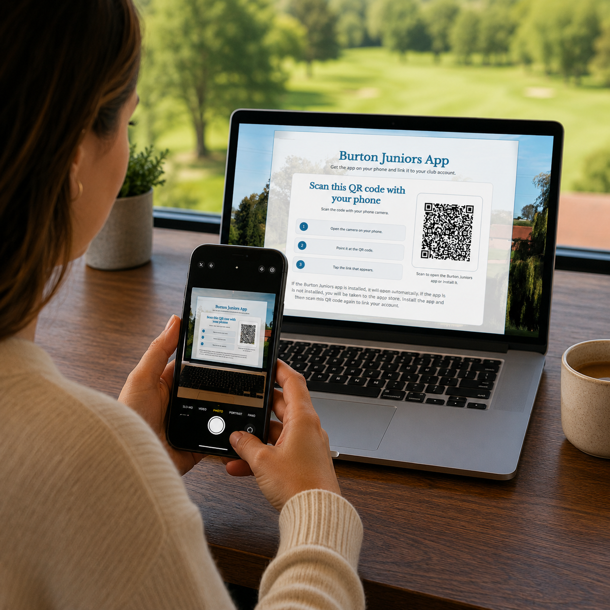

# Getting Started

If you're reading this guide, you've already successfully downloaded the app and linked it to your parent or guardian's account.

## Using the App on Your Own Phone

If you have your own smartphone or tablet, you can also download the app and link it to your own Intelligent Golf account. This allows you to access your progress, achievements, vouchers, messages, and learning resources directly from your own device.

Simply download the app from the App Store or Google Play Store and follow the registration process in the same way that your parent or guardian did.

## Need Help?

If you have any difficulties setting up the app, linking your account, or accessing any features, please contact the Burton Junior Golf team. We will be happy to help get everything working for you.

Once you're set up, you're ready to start working through your pathway, completing learning activities, earning achievements, and tracking your progress through the junior programme.