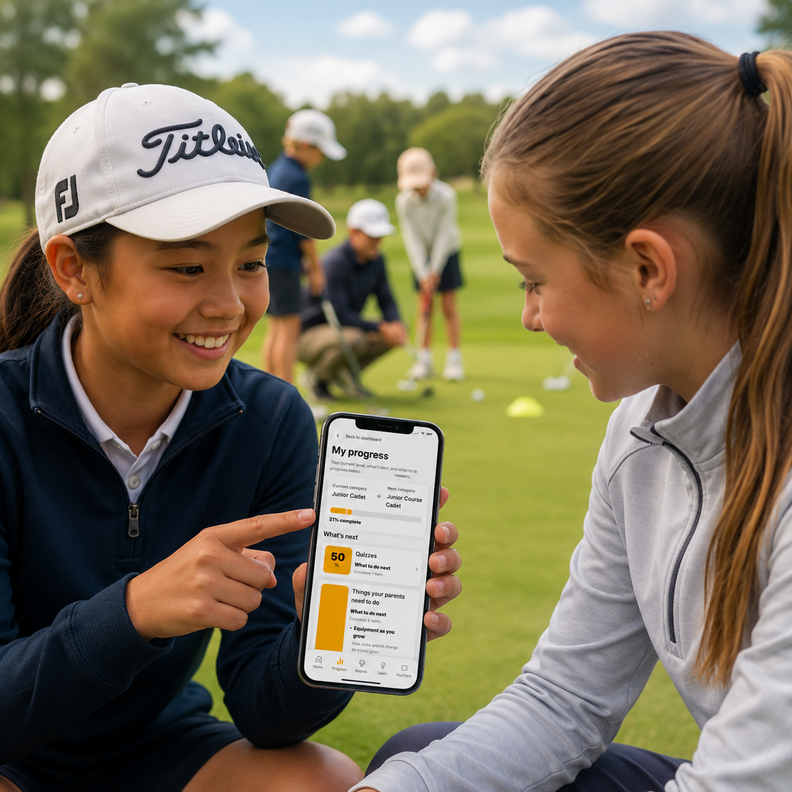

# My Progress

One of the most important areas of the app is the **My Progress** section.

This screen shows juniors and parents exactly where they are on their current pathway and what they need to do next. Whether that is completing rules quizzes, working through parent learning modules, arranging an on-course assessment, improving a handicap, or working towards personal goals, the app keeps everything in one place.

The progress shown will depend on the junior's current category and stage of development, but the app will always provide clear guidance on the next steps required.

We encourage both juniors and parents to check the **My Progress** section regularly, as it provides the clearest picture of what has been achieved so far and what opportunities lie ahead.