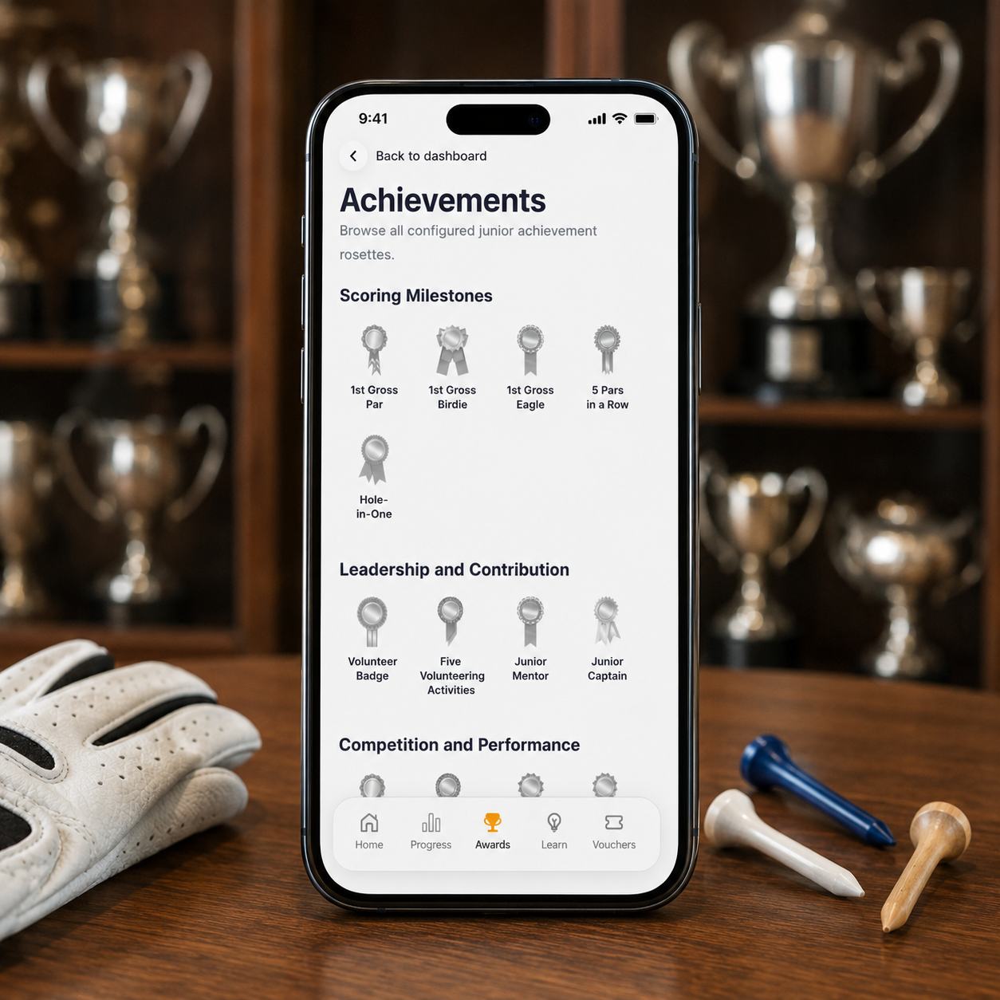

# My Achievements

The **My Achievements** section celebrates everything that juniors accomplish throughout their golfing journey.

Achievements can be awarded for a wide range of milestones, including learning, participation, performance, personal improvement, volunteering, leadership, and success in competitions. Whether it is playing a first 9-hole round, achieving a first gross par, obtaining a handicap, or being recognised for helping others, achievements help recognise and reward progress.

Each achievement unlocks a digital rosette which is added to the junior's collection. Over time, juniors can build an impressive record of their golfing journey and look back on everything they have accomplished.

Competition successes are recognised too. Trophies and competition results will appear within the dashboard, allowing juniors to keep track of their achievements both on and off the course.

Some achievements also include vouchers, which can be exchanged for selected items and rewards in the pro shop.

Just like the **My Progress** section, the **My Achievements** dashboard can be viewed by both juniors and their parents, helping families celebrate success together.