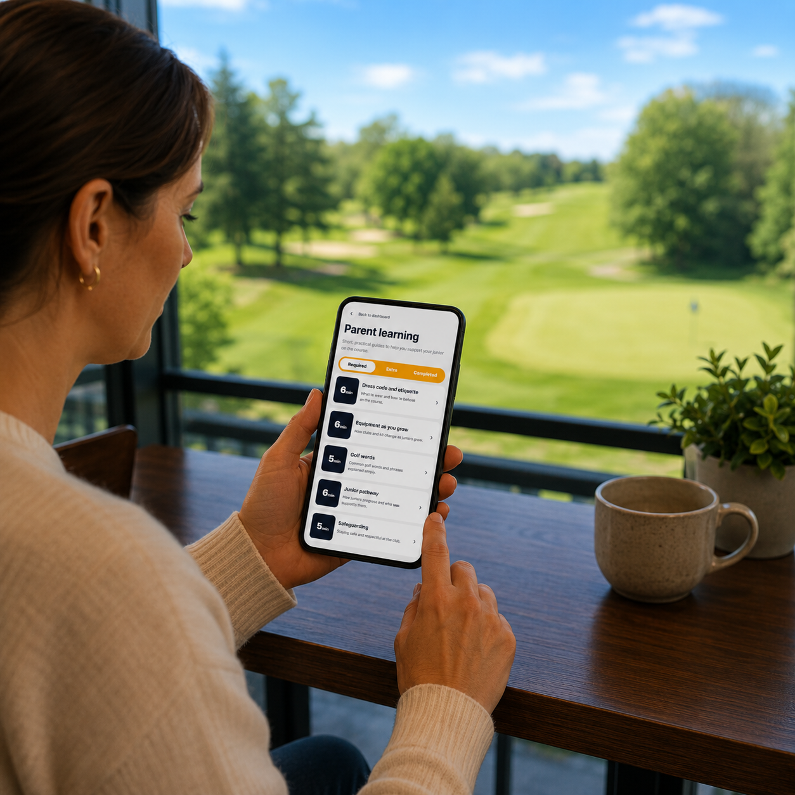

# Parent Learning

The **Parent Learning** section has been created to help parents and guardians support their child throughout their golfing journey.

The learning packs are designed as short, easy-to-follow modules covering topics that parents commonly encounter as their child progresses through the junior programme. They provide practical guidance, explain key concepts, and help parents better understand how junior golf works.

Some learning packs are mandatory, while others are optional. The packs that a parent is required to complete may vary depending on the golfing experience they told us about when registering.

We know that many of our juniors come from families with little or no golfing background. These learning packs help ensure that every parent has access to the information they need to confidently support their child, regardless of their own experience of the game.

The page you are reading now is one example of the learning resources available within the Parent Learning section.