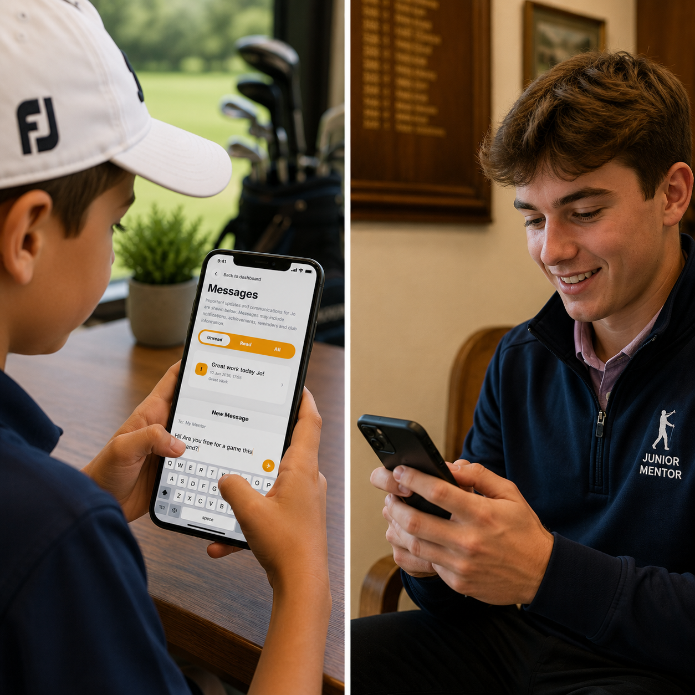

# Messages

The **Messages** section helps keep juniors and parents informed about everything happening within the junior programme.

Members of the junior team can send messages directly to juniors and their parents, ensuring that important information, updates, invitations, achievements, and opportunities are never missed.

As part of our safeguarding approach, parents automatically receive copies of communications sent to their child.

For juniors in the unrestricted section, the Messages area also provides access to their assigned junior mentor. These mentors are experienced older juniors who volunteer to support younger members as they progress through the programme.

Mentors can provide guidance, answer questions, help newer juniors settle into club life, and may even arrange opportunities to play together on the course.

We hope this mentoring programme helps build confidence, encourages friendships across age groups, and creates a culture where juniors support one another throughout their golfing journey.