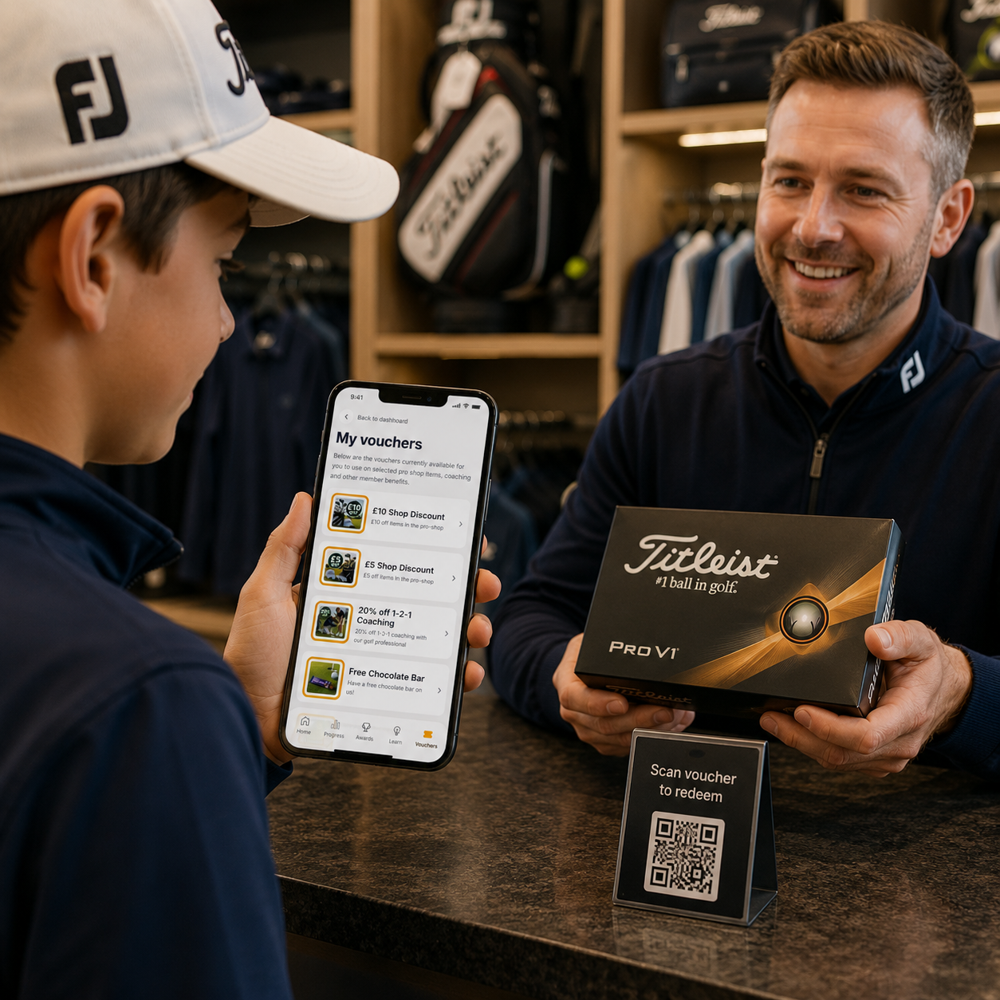

# Vouchers

The **Vouchers** section is where juniors can view and redeem all of the rewards available to them through the junior programme.

Our aim is to return the value of each junior subscription through a range of benefits that help children learn, improve, and enjoy their golf. These benefits include free group coaching, discounts on individual coaching, free items from the pro shop, and discounts on selected golfing products.

Many vouchers are provided as part of the junior membership programme, while others are awarded by the club to recognise special achievements. Juniors may receive additional vouchers for milestones such as obtaining their first handicap, progressing through the junior categories, or reaching other significant goals.

Every available voucher can be viewed within the app at any time. Each voucher includes a QR code that can be scanned by a member of staff in the pro shop, on the practice ground, or during coaching sessions to redeem the reward.

We encourage juniors and parents to check the Vouchers section regularly, as new rewards and achievement vouchers may be added throughout the year.