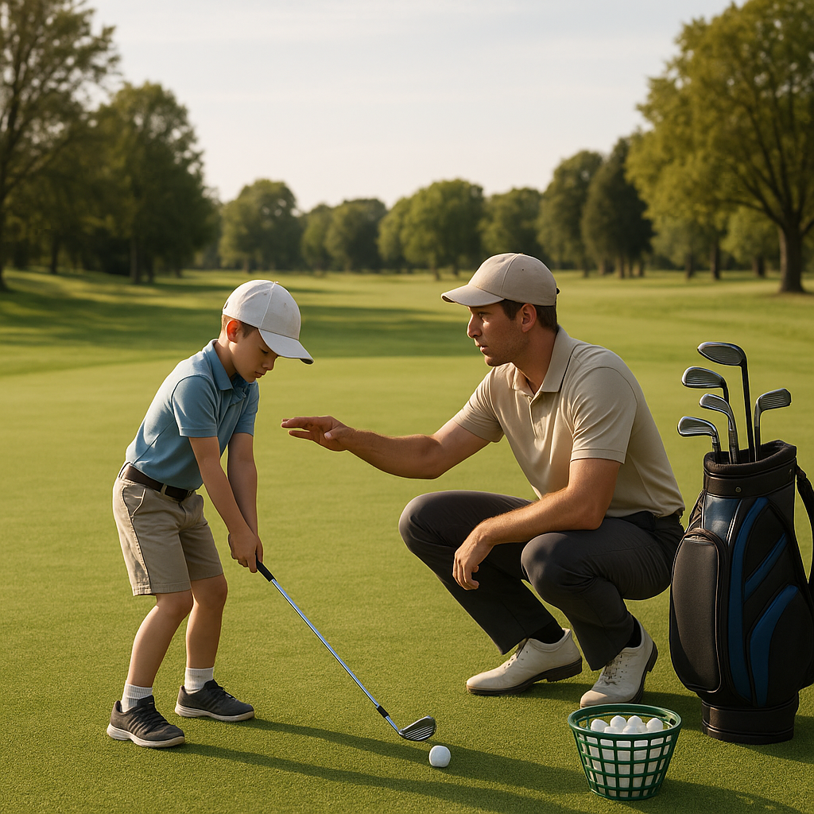

# Rules Made Simple

Understanding the rules of golf may seem overwhelming at first, but they are designed to ensure fair play and enjoyment for everyone on the course. Below are some fundamental rules that every junior golfer should know:

### 1. **Play Your Own Ball**
Always ensure you are playing your own ball. If another player's ball is closer to the hole, be sure to check that it is indeed your own before taking your shot.

### 2. **Teeing Off**
When you start a hole, you must tee off from behind the tee markers. Ensure that your ball is within the designated area. If you accidentally hit your ball from outside these markers, you will incur a penalty.

### 3. **Hitting the Ball**
When it’s your turn, take care to swing and hit your ball while it is still. Be aware of your surroundings and where other players are to avoid accidents.

### 4. **Lost Balls**
If you lose a ball or it goes out of bounds, you must return to the spot where you last played it and take a penalty stroke. 

### 5. **Putting on the Green**
When on the green, try not to step in anyone else's line to the hole. This means you should avoid walking on the grass that others have to putt over. You may also repair any pitch marks or other damage on the green.

### 6. **Keeping Score**
Each stroke you take counts towards your score. The goal is to complete the course with the fewest strokes possible. Keep track of your score on the scorecard provided.

### 7. **Respect the Course**
Always treat the course with care. This includes replacing divots, raking bunkers after using them, and disposing of litter properly. A well-maintained course ensures enjoyment for all.

### Helpful Tip:
When in doubt about a rule, ask a coach or experienced player for guidance. It’s perfectly fine not to know everything yet! Remember, everyone started out as a beginner.

With these basic rules in mind, you’re better prepared to hit the course with confidence. Next, we’ll discuss etiquette – the unwritten rules that help make golf a gracious and enjoyable game for all.
