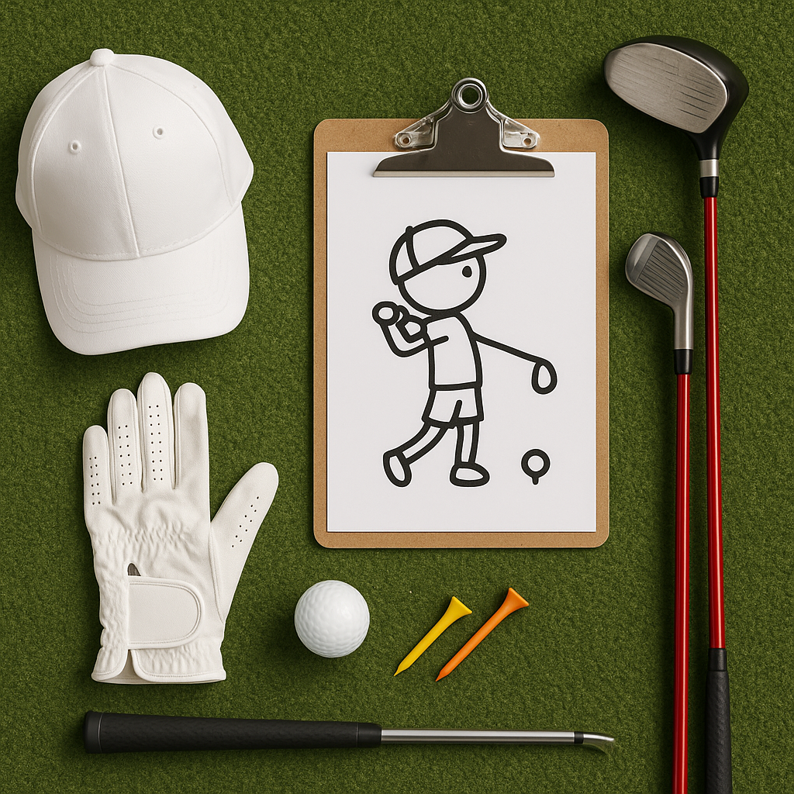

# Play the Ball as it Lies

In golf, one of the fundamental principles is to **play the ball as it lies**. This means that you should take your next shot from where the ball has come to rest, without moving it or improving your position. Here’s what you need to know:

### What This Means
1. **No Moving**: You cannot pick the ball up to place it in a better position. If your ball lands in a tricky spot—like in the rough or near a tree—you must play it from there.
2. **Natural Obstacles**: Sometimes, obstacles (like rocks, branches, or water) may be near your ball. You still need to play the ball as it lies, unless specific rules allow for relief (like in the case of unplayable lies).

### Why It Matters
This rule encourages golfers to develop skills in various playing conditions. Each lie offers a unique challenge, helping you to learn how to adjust your stance and swing.

### Tips for Playing the Ball as It Lies
- **Evaluate the Lie**: Look closely at how the ball is positioned. Is it on grass, sand, or in a bush? Understanding this will help you decide the best way to play your shot.
- **Consider Your Options**: If your ball is in thick grass or behind a tree, think about how you can strike the ball cleanly. Practising different lies will help you become more versatile.
- **Stay Calm**: It can be frustrating to have a challenging lie, but take a deep breath and focus on your technique. Every shot is an opportunity to learn.

### Practice Drill
1. **Choose various areas** on the practice green or driving range where you can simulate different lies (on the slope, near a tree, in longer grass).
2. **Take several shots from each lie**, paying attention to how you adjust your grip and stance based on the position of the ball.
3. After each shot, reflect on what worked well and what could improve for your next attempts.

Learning to play the ball as it lies not only adheres to the rules of golf but also enhances your overall game, teaching you resilience and creativity on the course. Keep practising, and soon you'll find yourself hitting great shots from all kinds of lies!
