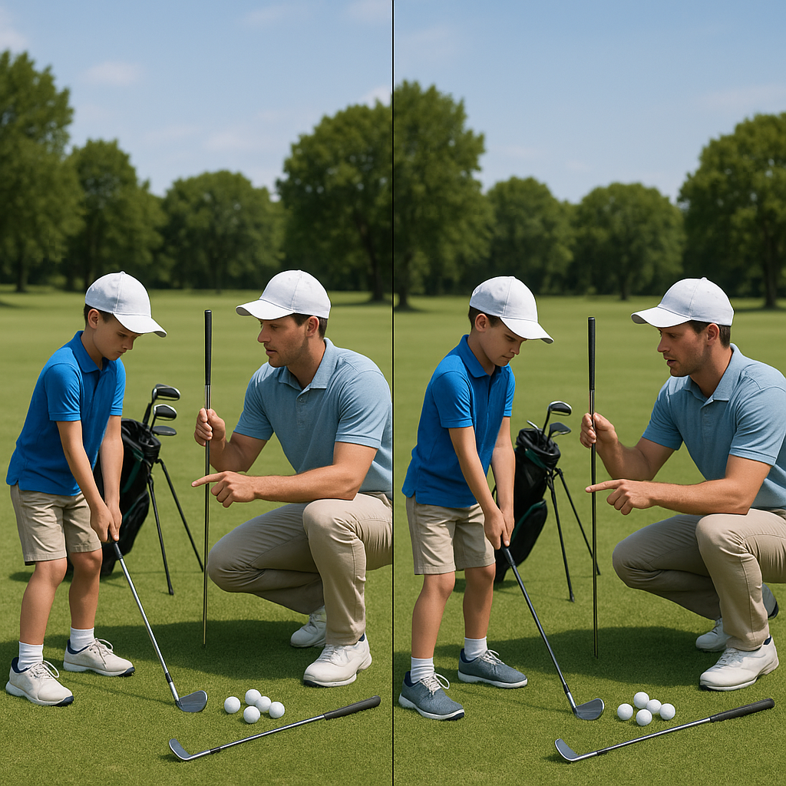

# Penalties and Drops

Understanding penalties and how to correctly drop your ball is a crucial part of golf. Let’s clarify this concept so you’re fully equipped for your next game.

### What is a Penalty?

A penalty is likely to occur when you break one of the rules. Penalties can affect your score and can happen in various situations, such as:

- Hitting your ball into a water hazard
- Missing the fairway and ending up in the rough
- Losing your ball

When a penalty occurs, it typically adds strokes to your score. For example, if you lose a ball, you must add one stroke and then go to where you believe the ball was lost to continue your play.

### Common Penalty Situations:

1. **Out of Bounds:** If your ball goes out of bounds, you’ll take a stroke penalty and drop a new ball where you last played.
  
2. **Ball in a Hazard:** If your ball lands in a water hazard, you can either play it as it lies or choose to take a penalty and drop it outside the hazard.

3. **Unplayable Lies:** If you find your ball in a position where you can’t play it (like behind a tree or in thick bushes), you can declare it unplayable, adding a stroke and dropping your ball within two club lengths of the original spot or back along the line of play.

### How to Drop a Ball:

When you need to drop a ball due to a penalty or an unplayable situation, follow these steps:

1. **Choose Your Spot:** Identify where you must drop the ball (either where the ball lies, two club lengths from the spot, or along the line of play).
   
2. **Hold the Ball:** Hold the ball at knee-height (about 6 inches above the ground).

3. **Drop the Ball:** Let the ball fall straight down without throwing or spinning it. 

4. **Ensure Compliance:** Make sure the ball lands within the correct area. If it rolls back into a hazard or out of bounds, you’ll need to drop it again.

### Remember:

- Always be aware of your surroundings and the other players. If you’re not sure about a rule or situation, it’s perfectly fine to ask for help!
- Taking penalties can be frustrating, but it’s all part of learning the game. 

This section lays the foundation for correctly managing penalties and drops, ensuring you’re ready for the challenges ahead on the course. Keep practising, and it’ll soon become second nature!
