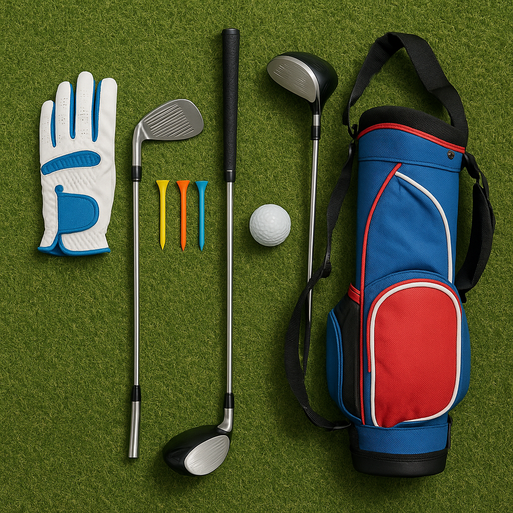

# Dress Code Basics

Understanding the basics of golf attire and etiquette is essential for junior golfers. Dressing appropriately not only shows respect for the game but also enhances your enjoyment on the course. Here are the key elements to consider:

### 1. Appropriate Attire
- **Shirts**: Collared polo shirts are the norm. T-shirts or tank tops are usually frowned upon. Choose comfortable, breathable fabrics that allow for easy movement.
- **Trousers/Shorts**: Smart trousers or tailored shorts are ideal. Make sure they’re not too short and fit well. Avoid denim or overly casual styles.
- **Footwear**: Golf shoes with soft spikes or trainers specifically designed for golf provide the best grip and stability. Avoid open-toed shoes or sandals.

### 2. Weather Considerations
- **Sun Protection**: On sunny days, wear a cap or a visor and consider applying sunblock. Lightweight long sleeves can also protect against sunburn.
- **Cold Weather**: Layer up! A light, long-sleeved top or a golf jacket can keep you warm without restricting movement. 
- **Rain Gear**: A waterproof jacket and trousers will keep you dry. Look for breathable materials so you remain comfortable.

### 3. Neatness Counts
- Always ensure your clothes are clean and free from rips or stains. Looking neat not only boosts confidence but also shows respect for fellow players and the course.

### 4. Personal Grooming
- Keep hair neat and tidy. If your hair is long, consider tying it back to maintain clear vision. 

### 5. Accessories
- Limit jewellery to simple pieces; large, dangling items can be distracting. Sunglasses can protect your eyes but choose styles that fit securely.

### Why It Matters
Golf is not just about playing; it's a tradition steeped in history. Dressing appropriately and following basic etiquette helps create a positive atmosphere for everyone involved, from beginners to seasoned players.

As you delve deeper into your golfing journey, remember that what you wear can impact your experience on the course. Stay comfortable, look smart, and enjoy the game!
