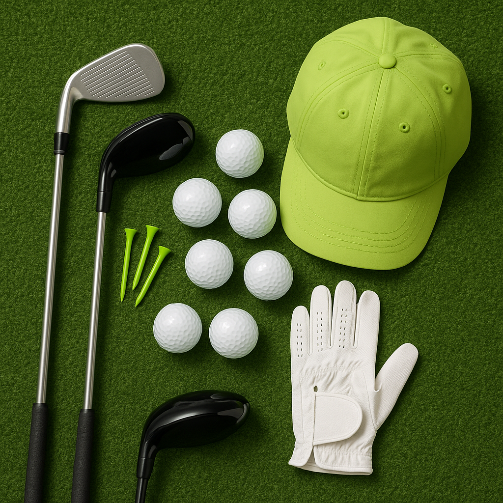

# Signs Equipment Needs Changing

As young golfers grow, their equipment must change to keep up with their development. Here are some key indicators that it may be time to invest in new gear:

### 1. **Physical Growth**
If your junior golfer is experiencing a growth spurt, their current clubs may become too short or too stiff. Watch for:
- Difficulty in reaching the ball comfortably.
- Awkward posture during swings.

### 2. **Consistent Performance**
Has your child’s game stagnated? If they are struggling to hit the ball straight or find consistent distance, their equipment could be a factor. Look out for:
- Excessive slicing or hooking.
- A noticeable drop in distance when hitting.

### 3. **Wear and Tear**
Clubs can wear down over time. Check for:
- Dents, rust, or significant scratches on clubheads.
- Fraying grips, which can affect control.

### 4. **Changing Swing**
As skills develop, so does a golfer’s swing. If your child is working on improving their technique, they may need different clubs to support this evolution:
- A shift from a natural draw to a fade.
- Adjustments in swing timing or speed.

### 5. **Leagues and Tournaments**
As they progress to more competitive play, having the right equipment becomes more crucial. Consider updating when:
- They join a new league with different regulations.
- They express interest in playing in tournaments.

### How to Make the Change

- **Consult a Professional**: A local pro can provide insights on the right equipment based on your child’s current skills and physical stature.
- **Try Before You Buy**: Encourage your child to test various clubs to find what feels comfortable and enhances their game.
- **Don't Rush**: Regularly assess their equipment, but it's important to balance need and budget; not every new season requires a complete overhaul.

Recognising these signs ensures your junior golfer has the best chance to enjoy the game and develop their skills effectively. Happy golfing!
