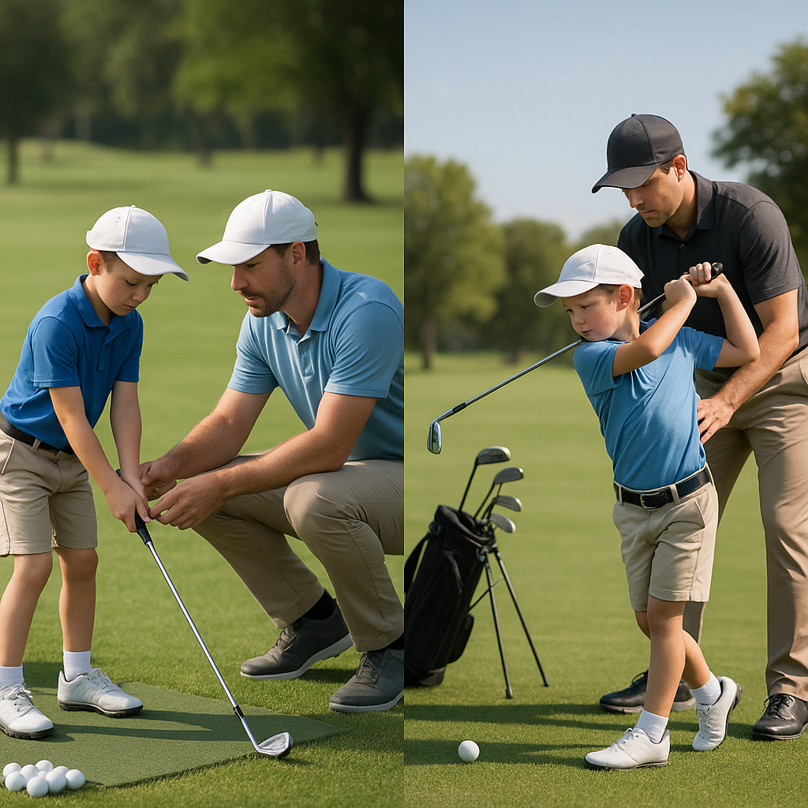

# Managing Cost

As your junior golfer embarks on this exciting journey, understanding the financial aspects of golf can make a significant difference. Growing in skill often means growing in equipment, but there are clever ways to manage costs without compromising on quality. Here are some tips:

### 1. **Consider Second-Hand Gear**
Not all equipment needs to be brand new. Explore second-hand shops or online marketplaces for gently used clubs, bags, and other accessories. Many players upgrade their gear regularly, so you could find great deals on equipment that still has plenty of life left.

### 2. **Prioritise Key Equipment**
When starting out, your junior golfer may only need a few essential items: a good set of clubs, golf balls, and appropriate footwear. Focus on these core items before expanding with less essential gear like gloves and accessories. 

### 3. **Rent Instead of Buying**
Some golf clubs offer rental services for equipment. If your junior golfer is still growing or is unsure about their commitment to the sport, renting can be a cost-effective alternative. 

### 4. **Look for Discounts and Promotions**
Many sports retailers run seasonal sales or promotions. Keep an eye out for discounts, especially during off-peak months, and benefit from significant savings. Signing up for newsletters can also alert you to special offers.

### 5. **Trade-In Programmes**
Some stores have trade-in programmes for old clubs. This way, you can earn credit towards purchasing new equipment. Not only does this help with costs, but it also encourages your junior golfer to stay engaged in their equipment choice.

### 6. **Set a Budget**
Having an established budget for golf-related expenses helps manage financial expectations. Discuss and set limits with your junior golfer regarding how much can be spent on gear each season.

By approaching the financial side of golf with a solid plan, you can ensure that your junior golfer has the right tools to grow while keeping costs manageable. As they develop their skills, investing wisely in equipment will support their progress without causing undue financial strain. 

Next up, we’ll explore how to find the right golfing environment for your budding champion!
