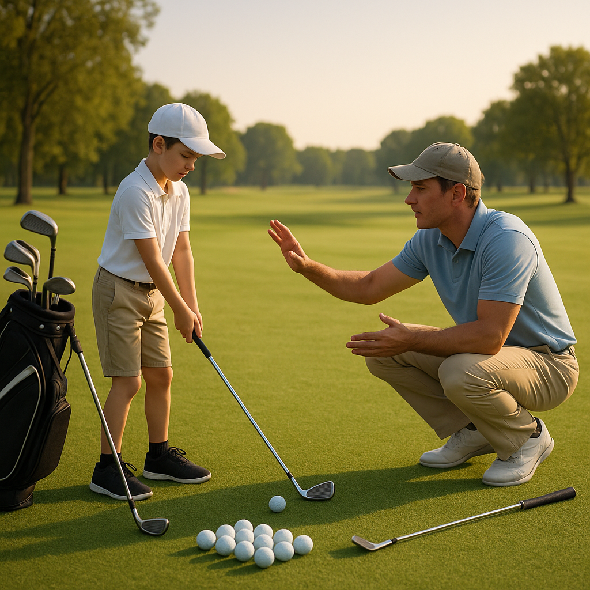

# Your First Competition

Getting ready for your first competition marks an exciting step in your golfing journey! It's normal to feel a mix of excitement and nerves, but remember, everyone is here to learn and have fun. Here’s how to prepare:

### Understanding the Format

Competitions can vary in format, but most likely, you will be playing a stroke play event. This means you’ll count the number of strokes you take to complete each hole, aiming for the lowest total score by the end.

### Getting Organised

**Check the Details:**
Make sure you know the date, time, and location of your competition. Arrive early to warm up and get familiar with the course.

**Bring Essentials:**
Pack your golf bag with all necessary equipment, including:
- Clubs (if you need them)
- Golf balls
- Tees
- Glove (if you wear one)
- Water and snacks
- Your scorecard and pencil

### On the Day

**Stay Positive:**
Remember that it’s just a game! Focus on enjoying the experience rather than stressing about the outcome.

**Warm-up:**
Spend some time at the practice area. Hit a few balls on the driving range, and don’t forget to putt for a while to get comfortable.

### Etiquette and Behaviour

Respect is key in golf. Here are some important points to remember during your competition:
- Maintain silence while others are taking their shots.
- Repair the course by fixing divots and ball marks.
- Shake hands with your playing partners after the round.

### After the Round

Regardless of how you performed, take time to reflect on your experience. What did you enjoy? What could you improve on for next time? Talk to your coach or parents about your thoughts and feelings.

### Keeping It Fun

Remember, competitions are about growing your skills and meeting new friends. Celebrate your achievements, big or small, and keep striving to improve. Enjoy every swing and embrace the excitement of the game!
