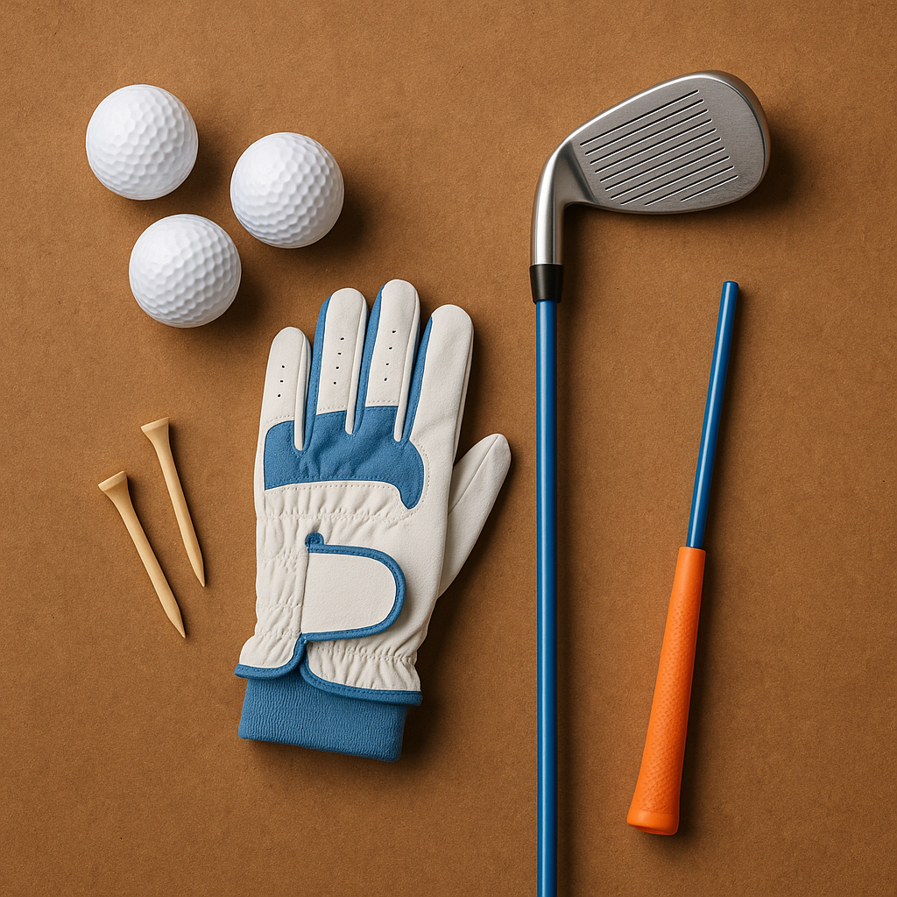

# Before you start

As you prepare to step onto the course for your first competitive round, it's essential to gather your thoughts and ensure you're ready for the experience ahead. Competing in golf can be exciting, but it can also bring about a few nerves. Here’s how to effectively prepare yourself and make the most of the day.

### Understanding the Environment

1. **The Course Familiarity**  
   If possible, visit the course beforehand. Walk the fairways, study the layout, and be aware of any tricky holes or hazards. Knowing the course will boost your confidence.

2. **Check the Rules**  
   Familiarise yourself with the basic rules of golf and any particular regulations for the competition. Understanding these can help you avoid unnecessary penalties and enjoy the game more.

### Preparing Physically and Mentally

1. **Dress for Success**  
   Wear comfortable golf attire suited to the weather. Layers can be beneficial, as temperatures can fluctuate. Don’t forget your golf shoes; they provide vital grip and stability.

2. **Stay Hydrated and Nourished**  
   Bring along a water bottle and some healthy snacks. Staying hydrated and having energy-boosting snacks will keep you focused during the competition.

3. **Set a Positive Mindset**  
   Instead of fixating on the outcome, set personal goals for your performance. Focus on aspects of your game you want to improve, such as your putting or swing consistency.

### The Day of the Competition

1. **Arrive Early**  
   Aim to get to the venue well ahead of your tee time. This will allow you to warm up properly and get in the right frame of mind.

2. **Practice Routine**  
   Use the practice area. Spend time on the driving range, and work on your short game. A quick warm-up can ease any nerves and get your body ready to play.

3. **Plan Your Warm-up**  
   Engage in a simple warm-up routine to get your muscles moving. Stretching and a few practice swings can help prevent injuries and enhance your performance.

### Key Reminders

- **Breathe and Relax**: Take a few deep breaths if you start to feel anxious. Staying calm will help you perform at your best.
  
- **Enjoy the Experience**: Remember, competitions are opportunities to learn and grow, regardless of the outcome. Embrace the fun of meeting new friends and playing the game you love.

By taking the time to prepare thoroughly, you're setting yourself up for a rewarding experience. Now, let’s explore how to navigate the competition day effectively!
