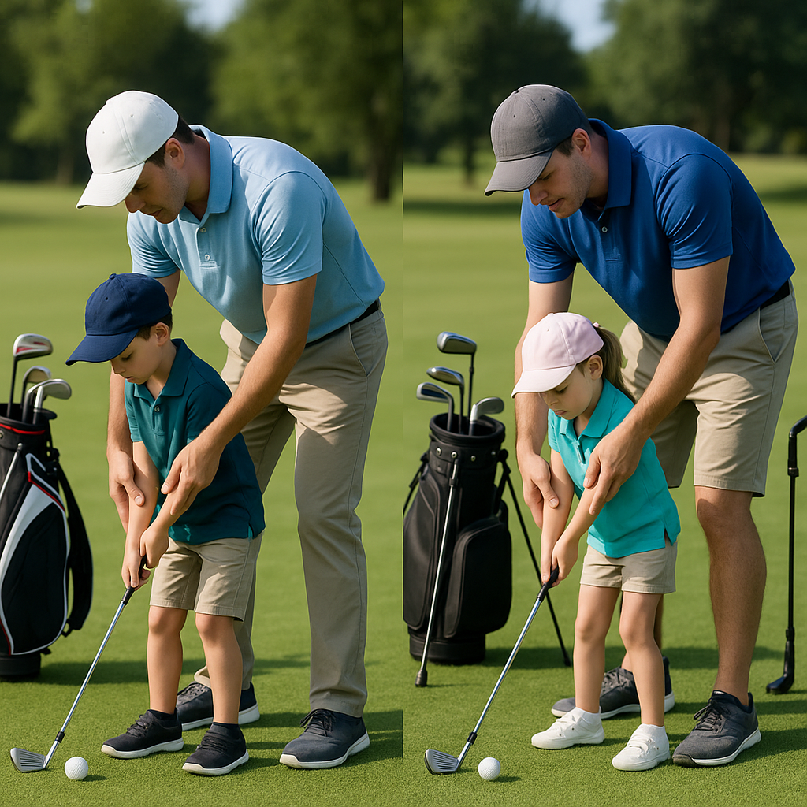

# After the Round

Congratulations on completing your first competition! This is an exciting time as you reflect on your experiences and begin to learn from them. Here’s how to make the most of what you've just accomplished:

### Reflect on Your Performance
Take a moment to think about your round. What did you do well? Was there a particular hole or shot you felt proud of? Recognising your strengths boosts your confidence. 

### Areas for Improvement
Every round is a learning opportunity. Consider aspects that might not have gone as planned. Did you find the pace of play challenging? Were there any specific skills, like putting or chipping, that could use some attention? Identifying these areas will help you focus on your next practice sessions.

### Gather Feedback
If you played alongside friends, or if a coach was present, ask them for their thoughts. Constructive feedback can provide insights you may not have noticed. 

### Celebrate Achievements
Remember to celebrate your efforts! Whether it’s making a great putt or simply enjoying your time on the course, recognising your achievements can be motivating.

### Consider Your Next Steps
Now that you've experienced competition, think about your goals moving forward. Do you want to enter more competitions? Perhaps focusing on a particular skill during practice will help you feel even more prepared next time. 

### Enjoy the Journey
Golf is as much about enjoyment as it is about improvement. Share your experiences with family and friends, and don't forget to have fun!

Take this time to recharge and look ahead with excitement toward your next round. Learning and growing in golf can be a rewarding adventure!
