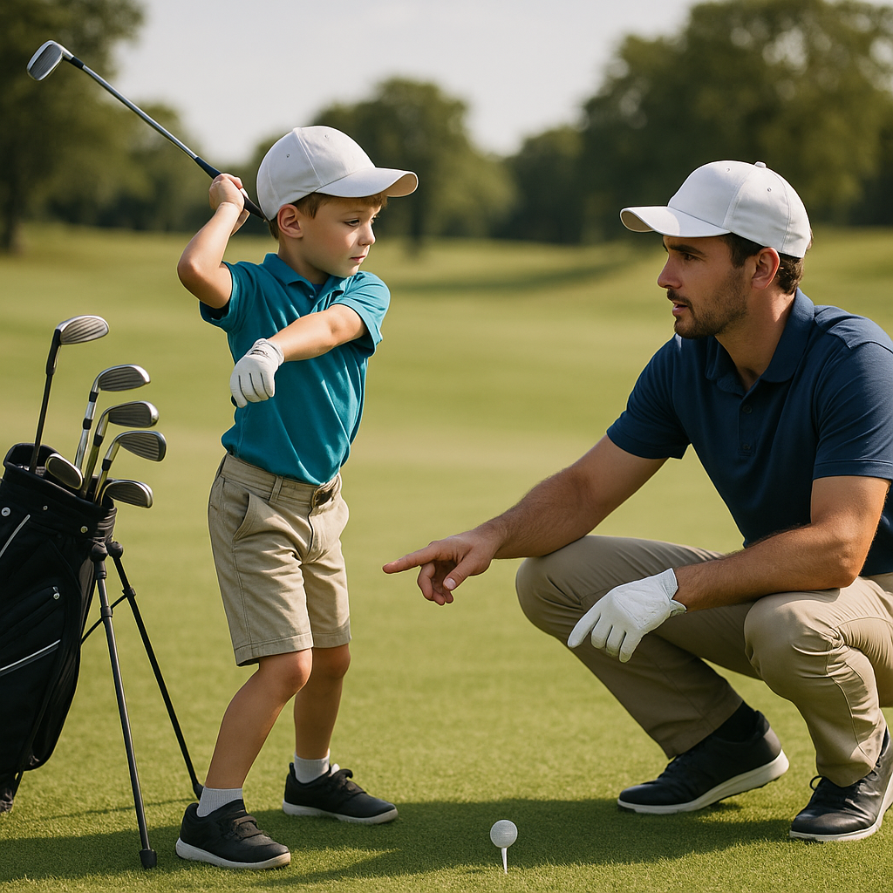

# Quick Check

As you gear up for your first competition, it's essential to ensure you're ready both mentally and physically. Here’s a handy checklist to help you feel prepared and confident.

### Equipment Essentials:
- **Clubs**: Have you packed your full set to meet the rules?
- **Balls**: Bring at least a few extra—better safe than sorry!
- **Tees**: Don’t forget your tees; pack both standard and short ones.
- **Gloves**: A comfortable glove can make a big difference.
- **Clothing**: Dress suitably for the weather and ensure your attire meets the club’s dress code.

### Mental Preparation:
- **Know the Format**: Are you clear on whether you'll be playing stroke play or match play?
- **Rules Familiarity**: Do you understand the basic competition rules? Refresh your knowledge for any unfamiliar scenarios.
- **Game Plan**: Have you thought about how you'll approach the course? Plan for tricky holes or strategies for your strengths.

### Physical Readiness:
- **Warm-Up**: Will you arrive early enough for some stretching and practice swings?
- **Hydration & Snacks**: Have you prepared a bottle of water and healthy snacks to keep your energy up during the round?

### Support System:
- **Caddy or Parent**: Will someone be there to support you? Discuss any strategies or needs before the day.
- **Mindset**: Are you feeling positive and ready to enjoy the experience?

### Final Thoughts:
Competing can be nerve-wracking, but remember that every golfer has been in your shoes. Keeping this checklist in mind can help ease your nerves and set you up for a successful and enjoyable day. Embrace the experience, have fun, and let your love for the game shine through!
