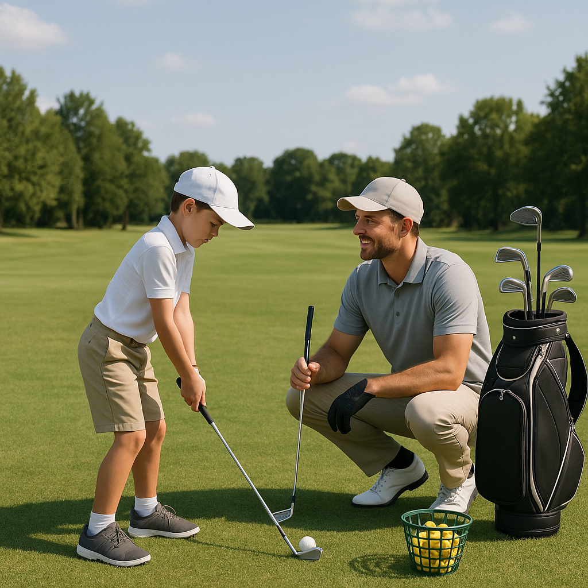

# Your First Round

Congratulations! You’ve made it to the course for your very first round of golf. Here’s what to expect and how to make the most of your experience.

## Preparing for the Course

Before you step onto the course, it’s essential to familiarise yourself with a few key aspects that will help you feel at ease:

1. **Dress Code:** Many golf courses have specific attire regulations. Generally, collared shirts, smart shorts or trousers, and golf shoes are appropriate. Check the course’s dress code to avoid any surprises.

2. **Equipment Check:** Ensure you have your golf clubs, balls, tee, glove, and a water bottle. A basic golf bag can help you carry your things easily.

3. **Arrive Early:** Aim to arrive at least 30 minutes before your tee time. This allows you to check in, warm up, and practise on the putting green or driving range.

## Understanding Course Etiquette

Golf is not just about hitting the ball; it’s also about respecting the game and other players. Here are a few points to keep in mind:

- **Silence is Golden:** When someone is about to take a shot, remain quiet and still. This helps them concentrate.
  
- **Teeing Off:** Wait for your turn and be ready when it’s time for you to hit. The player farthest from the hole tees off first.

- **Keep Pace:** Be mindful of the time. If you’re playing with others, try to keep up with the group ahead of you. If you’re slower, allow faster players to pass when it's safe.

## Enjoying Your Round

As you walk the course, here are a few tips to enhance your enjoyment:

- **Stay Positive:** Every golfer has good and bad shots. Focus on your progress and appreciate the experience rather than being overly critical of your performance.

- **Ask Questions:** If you’re unsure about something, don’t hesitate to ask your playing partners or course staff. Everyone was once a beginner!

- **Relax and Have Fun:** Remember, golf is a game! Enjoy the scenery, the company, and the chance to learn something new.

## After the Round

Once you finish your round, take a moment to reflect on your experience. What did you enjoy? Was there something you found challenging? Setting goals for your next round can be a great way to improve.

Happy golfing, and get ready for more adventures on the course!
