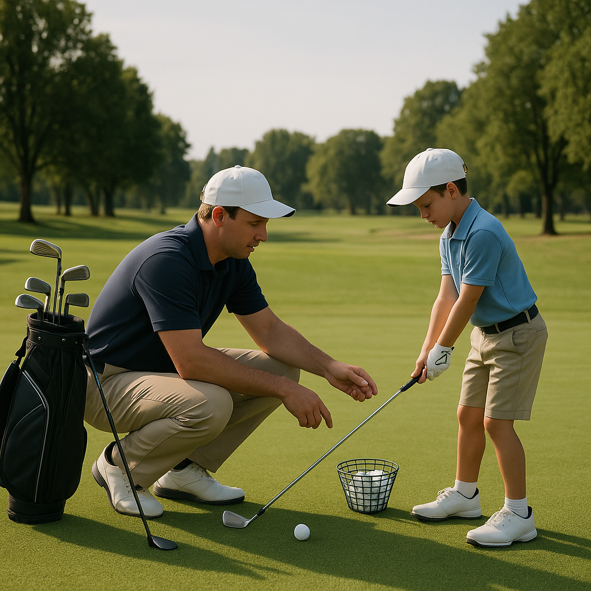

# Golf Language

Understanding the terminology used in golf can enhance your experience on the course. Here’s a list of common golf terms to help you communicate confidently and gain a greater appreciation of the game.

### Common Golf Terms:

1. **Tee**: This is a small device used to elevate the golf ball above the ground for the first stroke on each hole. It’s also the area where you start each hole.

2. **Fairway**: The well-manicured grass area between the tee box and the green. It's where you want your ball to land because it's easier to hit from here.

3. **Green**: The area around the hole with very short grass, where players putt to try and get the ball into the hole.

4. **Par**: The standard number of strokes that an experienced golfer is expected to take to complete a hole or a course. Each hole generally has its own par.

5. **Birdie**: When a golfer completes a hole one stroke under par. For example, if a hole is a par 4 and you complete it in 3 strokes, you have made a birdie!

6. **Bogey**: This term describes when a golfer takes one stroke over par to complete a hole. If you take 5 strokes on a par 4, that's a bogey.

7. **Club**: The tool used to hit the golf ball. Different clubs are designed for different types of shots, such as drivers, irons, and putters.

8. **Swing**: The action of swinging the club to hit the ball. A good swing is crucial for making solid contact with the ball.

9. **Chip**: A short shot that is typically made near the green, often used to get the ball up and over a small obstacle before it lands softly on the green.

10. **Putt**: A gentle stroke used to roll the ball into the hole while on the green. Accurate putting can make a significant difference in your score.

### Practice Tip:

Try to use these terms during practice sessions or while watching golf together. This shared language can help you bond over the game and deepen your understanding. For added fun, create flashcards with these terms and their meanings to quiz each other!

As you continue to learn and play, you’ll find that knowledge of these words will empower you, making your golfing journey even more enjoyable. Keep practicing and stay curious!
