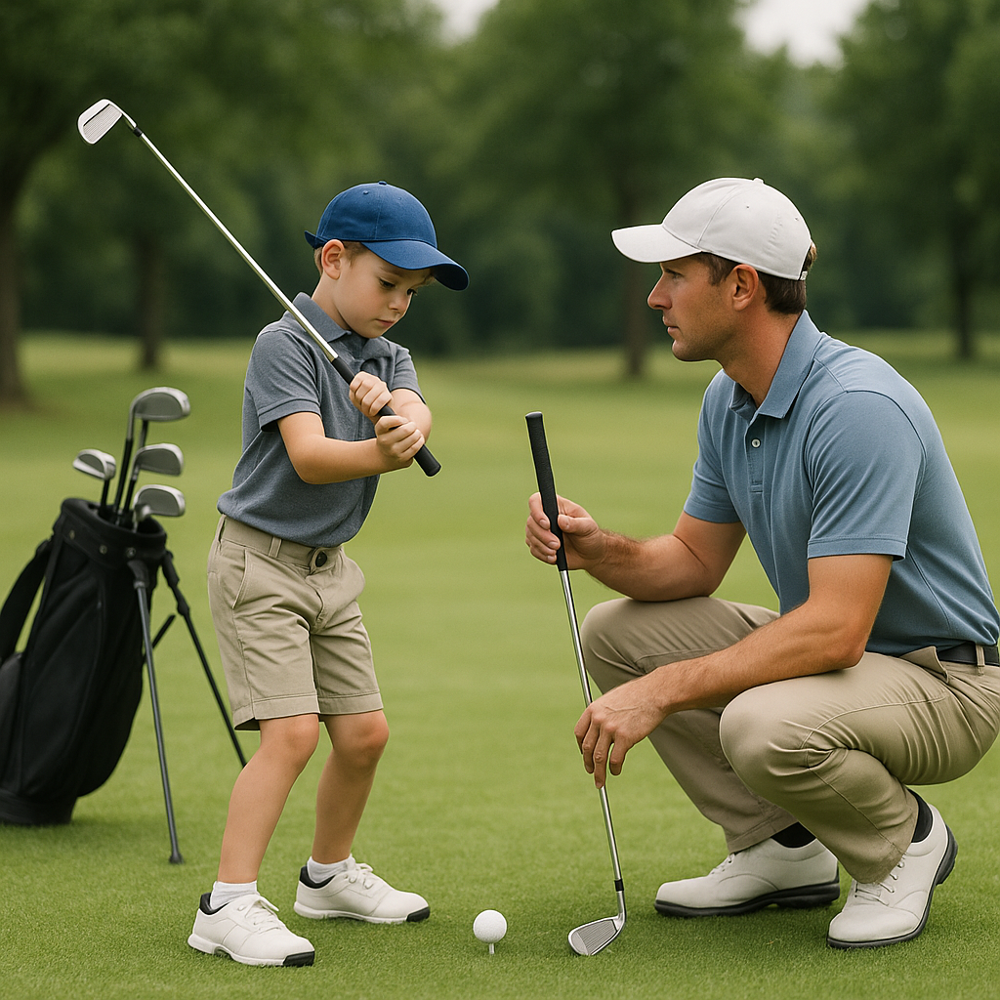

# Quick Check

Now that you've familiarised yourself with the essential golf vocabulary, it's time for a quick review. This will help reinforce your understanding and prepare you for your next lesson on the course.

### Activity: Match the Words

Draw lines to match the golf words with their correct meanings.

1. **Birdie**  
   A. A shot that goes over par

2. **Tee**  
   B. A small device to hold the ball off the ground

3. **Par**  
   C. One stroke under par for a hole

4. **Eagle**  
   D. The standard number of strokes for a hole

5. **Bogey**  
   E. One stroke over par for a hole

### True or False

Read the statements below and decide whether they are true or false. 

1. A tee is used to start play at a hole.  
   - True / False

2. Hitting an eagle means you took more strokes than par.  
   - True / False

3. A birdie is better than par.  
   - True / False

4. A bogey is a good score.  
   - True / False

5. Golf is played on a course with 18 holes.  
   - True / False

### Reflection

Take a moment to think about what you've learned so far. Ask yourself:

- Which new word do you find most interesting?
- How do you feel about using these terms when you're out on the course?

### Next Steps

When you're ready, move on to our next topic: **Essential Skills for Junior Golfers.** This will empower both you and your young golfer to understand the basics of playing through practice and play. Let’s keep the momentum going!
