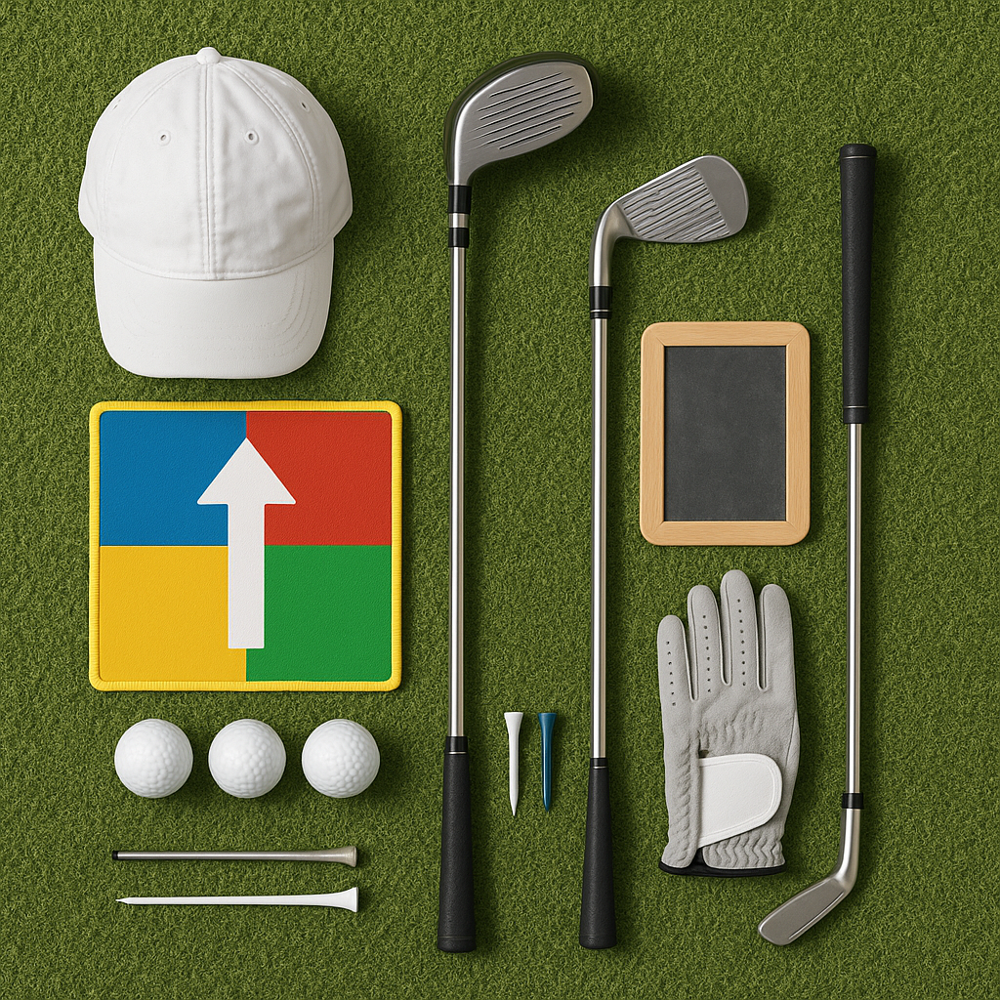

# Submitting Scores

Now that you understand what a handicap is, it’s time to learn how to submit scores. Keeping track of your performance on the course is crucial, as it helps adjust your handicap and gives you a clearer picture of your progress.

### Why Submit Scores?

- **Track Your Improvement**: Recording your scores allows you to identify strengths and areas for improvement.
- **Adjust Your Handicap**: Regularly submitting scores helps ensure your handicap reflects your true ability.
- **Participation in Competitions**: Many events require players to have submitted scores to be eligible.

### What You Need to Submit

1. **Date of Play**: Note the day you played.
2. **Course Information**: Make sure to include the course name and any relevant details, such as the tee played.
3. **Scorecard**: Keep your scorecard safe and a record of your total strokes for the round.

### How to Submit

- **Online Submission**: Many golf clubs have online systems. This is usually the easiest option. Make sure to set up your account and follow the provided guidelines.
- **In-Person**: You can also submit your score at your golf club’s office or to your coach. Bring your scorecard, and they’ll assist you with the submission process.
- **Mobile Apps**: Certain clubs may have dedicated apps for submitting scores. These can often link directly to your handicap.

### Best Practices

- Make it a habit to submit your scores immediately after your round. This ensures you're keeping your information current.
- Encourage your parents or guardians to help you if you're unsure how to submit scores, especially the first few times.
- Talk to your fellow junior golfers about their experiences. They can offer tips and share their own ways of keeping track.

### Reflection

After submitting your scores, take a moment to reflect on your game. What went well? What could be improved next time? Keeping a little diary about your experiences can also help track your growth as a golfer.

Next, we’ll explore how to interpret your scores and understand the factors that influence your game. Happy golfing!
