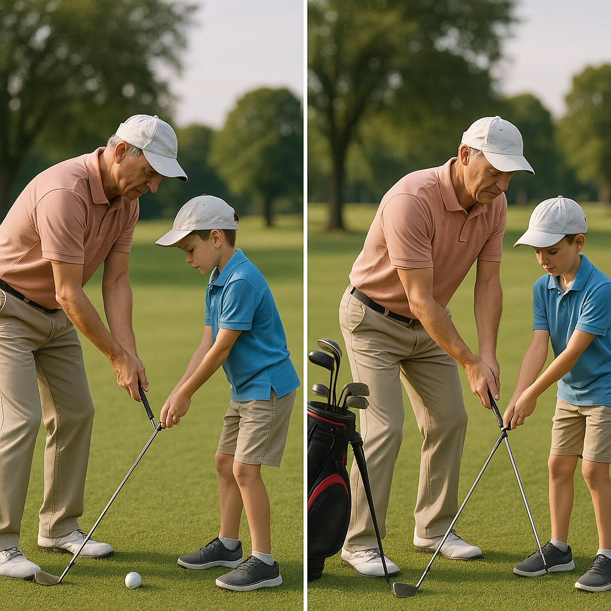

# Getting Support

Embarking on your journey in golf can sometimes feel overwhelming, but remember, you’re not alone! Here’s how to ensure you have the support you need to thrive, both on and off the course.

## Find a Mentor

Connecting with a mentor—perhaps a coach or an experienced player—can offer valuable insights. They can guide you in refining your skills while sharing essential tips based on their own experiences. Don’t hesitate to ask questions; every player has been in your shoes!

## Join a Club

Becoming part of a junior golf club is a fantastic way to make friends who share your interests. Clubs often organise training sessions, competitions, and social events that can make learning fun! You’ll learn from each other, and the camaraderie of playing together can boost your confidence.

## Family Involvement

Your family plays a significant role in your golfing journey. Encourage them to attend your games, support your training, and celebrate your achievements, no matter how small. Having loved ones cheer you on can make all the difference!

## Online Communities

Explore online forums and social media groups dedicated to junior golf. These platforms are great for asking questions, sharing experiences, and learning from fellow young golfers. Just remember to stay safe online – only share personal details with trusted individuals.

## Resources

Utilise the various resources available to you:
- **Books & Magazines:** Plenty of golf literature can enhance your understanding of the game.
- **Videos:** Online tutorials can be helpful for visual learning, allowing you to watch techniques in action.
- **Apps:** Many golfing apps provide tips, track your progress, and even help with scoring.

Remember, support is all around you! Embrace it, and it will help you grow not only as a golfer but as a person. Next, we’ll delve into setting personal goals—an essential step in your golfing journey!
