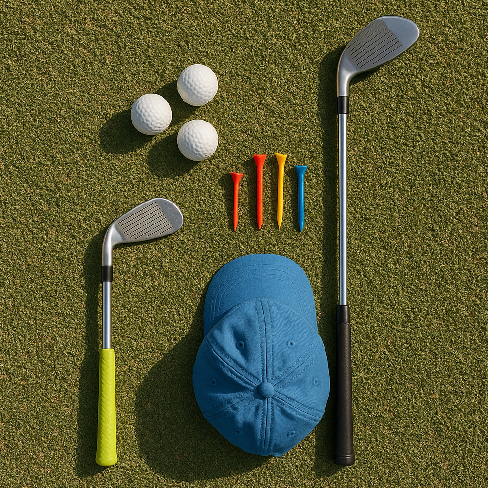

# Avoid Comparison

In your golfing journey, it's easy to start comparing yourself to other players—whether they’re your friends, a sibling, or even professional golfers on television. However, comparison can often lead to frustration and self-doubt. Here’s how to focus on your own path:

### Everyone's Journey is Unique

Every golfer advances at their own pace. Some may pick up the sport quickly, while others might take longer to master the basics. Celebrate your individual progress instead of measuring it against someone else’s.

### Set Personal Goals

Instead of aiming to beat someone else, set goals that are meaningful to you. This could be mastering a particular swing technique, improving your putting skills, or lowering your scores. Focusing on your goals keeps your attention on personal improvement.

### Reflect on Your Progress

Take time after each practice session or game to reflect on what you’ve achieved, no matter how small. Did you make a good shot? Did you connect better with your clubs? Recognising these moments boosts confidence and reinforces your love for the game.

### Engage in Positive Self-Talk

Replace negative thoughts with uplifting affirmations. Instead of thinking, “I wish I could swing like him,” say to yourself, “I’m improving every day, and that's what counts.” Positive self-talk can transform your mindset and enhance your performance.

### Learn from Others

Instead of comparing your skills, find inspiration in others. Watch their techniques, ask for tips, or even practice alongside them. Every player has something to teach, and by learning from others, you can enhance your own game without falling into the comparison trap.

### Enjoy the Game

Ultimately, golf is about enjoyment. Focus on what brought you to the sport in the first place: the thrill of hitting a great shot, the camaraderie with friends, or the beauty of the course. Keeping the fun in the game will help you stay motivated through any challenges you may face.

Remember, your golfing journey is just that—yours. Embrace it, enjoy it, and keep pushing forward!
