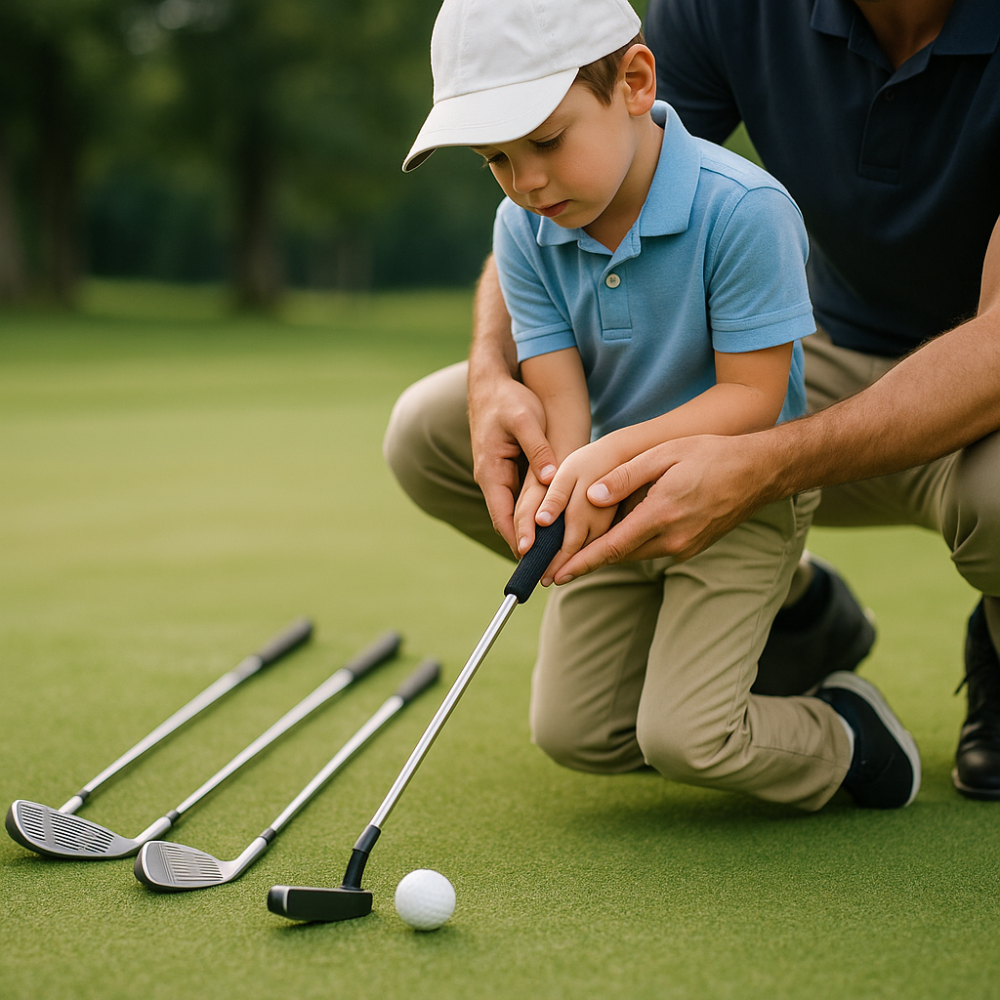

# How Parents Can Help

As your child embarks on their golfing journey, your support is crucial, especially during challenging times. Here are some effective ways to assist them:

## Encourage a Positive Mindset

- **Reinforce Positivity**: Remind your child that setbacks, like not improving for a while, are part of learning. Share stories of famous golfers who faced challenges.
- **Focus on Effort**: Praise their hard work rather than just outcomes. This helps develop resilience and a love for the sport.

## Promote Consistent Practice

- **Create a Routine**: Help establish a regular practice schedule. Consistency builds confidence and skill over time.
- **Fun Activities**: Integrate games or drills that focus on skills in a playful manner, making practice enjoyable rather than a chore.

## Be Their Cheerleader

- **Attend Events**: Be there for every match or practice session. Your presence can motivate and reassure them, especially when the going gets tough.
- **Celebrate Small Wins**: Acknowledge improvements, no matter how small. This will help your child recognise their progress and keep them motivated.

## Offer a Listening Ear

- **Open Communication**: Encourage your child to express their feelings about their golfing experience. Listen without judgement, providing comfort and understanding.
- **Problem-Solving Together**: Help them brainstorm solutions when they face challenges. This can foster critical thinking and empower them to overcome obstacles.

## Maintain a Balanced Perspective

- **Keep Golf in Perspective**: Remind your child that golfing is just one part of life. Emphasising balance can relieve pressure.
- **Encourage Diverse Interests**: Support other hobbies or sports they might enjoy. This can alleviate the pressure to excel in golf alone.

By being an engaged and supportive presence, you can play a significant role in helping your child navigate the ups and downs of their golfing journey, making their experience enjoyable and rewarding.
