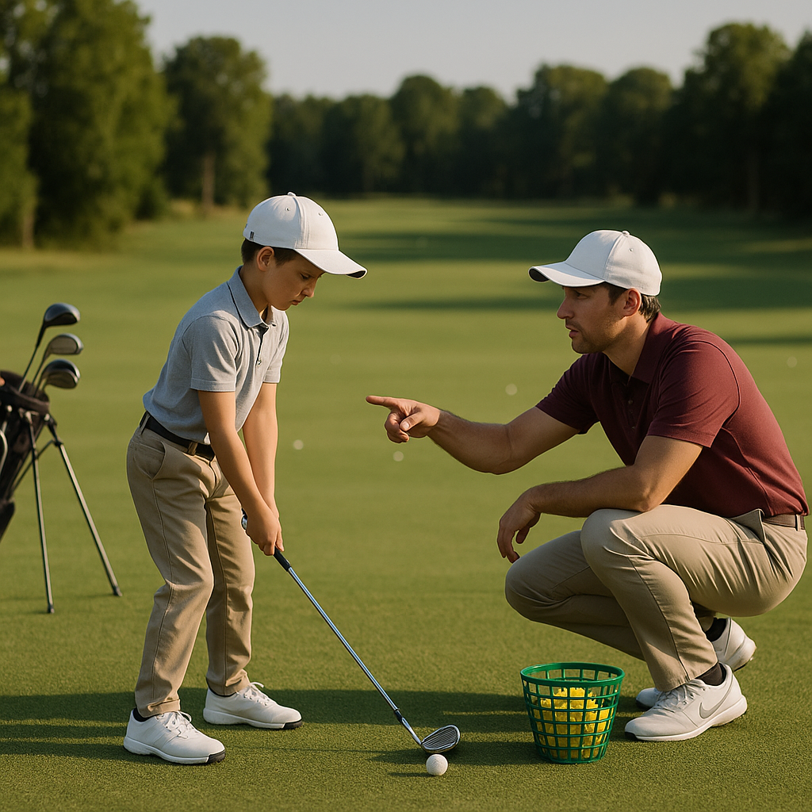

# The Junior Pathway

As you embark on this exciting journey into the world of golf, understanding the pathway ahead can help make your experience fulfilling and enjoyable. This pathway is designed to guide new junior golfers through essential skills, knowledge, and opportunities to progress in their golfing adventure.

## Key Stages

1. **Getting Started**
   - **Fundamental Skills:** Focus on grip, stance, and posture. These basics will form the foundation of your golf game. Practise swinging with a light club and learn how to make contact with the ball.
   - **Play with Friends:** Play simple games with friends. A friendly competition can keep things fun and engaging!

2. **Skill Development**
   - **Short Game Mastery:** Spend time around the green enhancing your chipping and putting skills. These are crucial for lowering your scores.
   - **Full Swing Practice:** Work on your full swing technique, beginning with shorter clubs like wedges and progressing to longer irons and drivers.

3. **Understanding the Game**
   - **Rules and Etiquette:** Familiarise yourself with the basic rules of golf and the importance of etiquette. This includes being respectful of other players and maintaining the course.
   - **Playing Rounds:** Start playing on the course in a relaxed setting, perhaps with family or friends. This will help you become comfortable in a real-game scenario.
  
4. **Advanced Skills**
   - **Course Management:** Learn how to plan your strategy for each hole. Understanding when to play safe and when to take risks is key to becoming a better golfer.
   - **Fitness and Flexibility:** Incorporate stretching and fitness routines into your training. Golf requires a unique combination of strength and flexibility.

5. **Competitive Play**
   - **Joining Tournaments:** As your skills progress, consider entering local junior tournaments. These events provide valuable experience and help you measure your improvement.
   - **Coaching Opportunities:** Seek out coaching sessions for tailored advice and professional techniques. Many clubs offer lessons specifically designed for juniors.

## Stay In Touch

Remember, golf is as much about personal growth and enjoyment as it is about skill and competition! Engage with fellow junior golfers, join clubs, or participate in community events to enhance your love for the game.

Now, let’s move on to some exciting drills that will help you develop your skills further!
