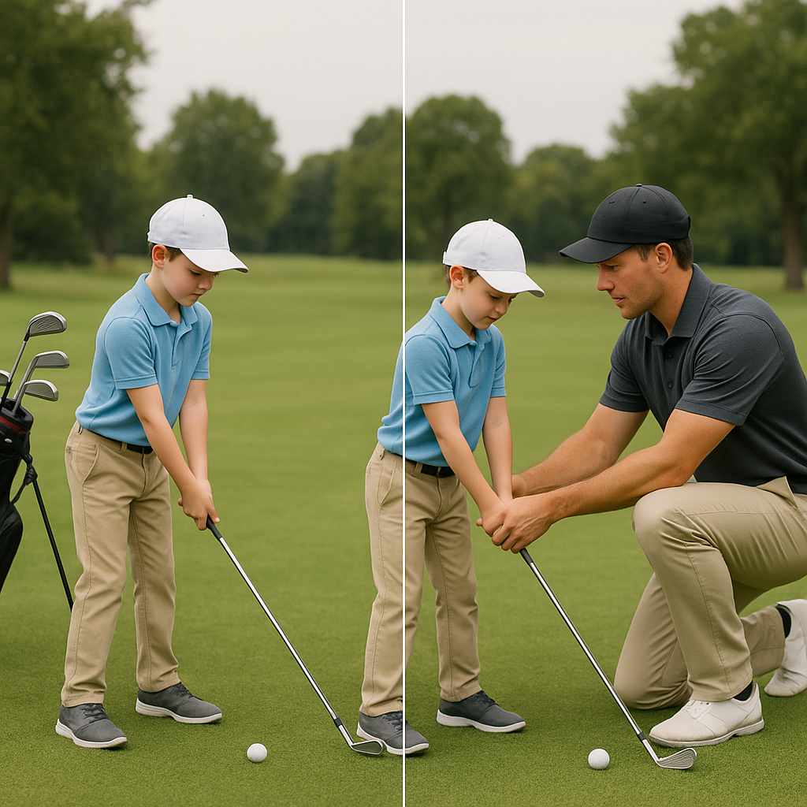

# Expectations and Support

As you and your young golfer embark on this exciting journey, it’s important to establish clear expectations and understand how to provide the right support. This will help your child grow in skill and confidence on the course. Here are a few key points to consider:

## Setting Realistic Goals

Encourage your junior golfer to set achievable goals, whether it’s mastering a particular swing technique or simply improving their scores. Goals should be:

- **Specific**: Clearly define what they want to achieve, such as "I want to hit the ball straight more often."
- **Measurable**: Make it easy to track progress, like aiming to reduce their score by a few strokes over a month.
- **Attainable**: Ensure goals are within reach, balancing ambition with realism.
- **Relevant**: Goals should align with their interests and ambition in golf.
- **Time-bound**: Set deadlines to help provide motivation.

## Understanding Development Stages

Every junior golfer progresses at their own pace. Be patient and supportive as they develop their skills. Remember, the pathway is designed to foster growth, and it’s perfectly normal for some areas to take longer to master than others.

## Building Confidence

Encouragement is crucial. Celebrate achievements, no matter how small, and offer constructive feedback on areas for improvement. This positive reinforcement will help build your child’s confidence and passion for the game.

## Parent Involvement

Your role is pivotal! Engage with your child’s golf journey by:

- **Attending practices and competitions**: Be their biggest cheerleader.
- **Understanding the game**: Familiarise yourself with the rules, etiquette, and culture of golf to enhance your conversations.
- **Encouraging independence**: While guidance is important, allow your junior golfer to make decisions on the course to foster problem-solving skills.

## Balancing Fun and Competition

While learning and improvement are important, don’t lose sight of the joy of playing golf. Keep the atmosphere light-hearted, especially during practice and play. Encourage a healthy competitive spirit but remind your child that the ultimate goal is to enjoy the game.

By setting clear expectations and providing thoughtful support, you’ll create an environment where your junior golfer can thrive and develop a lifelong love for golf. 

Next, we will delve into the strategies for effective practice, helping your child to maximise their learning experience.
