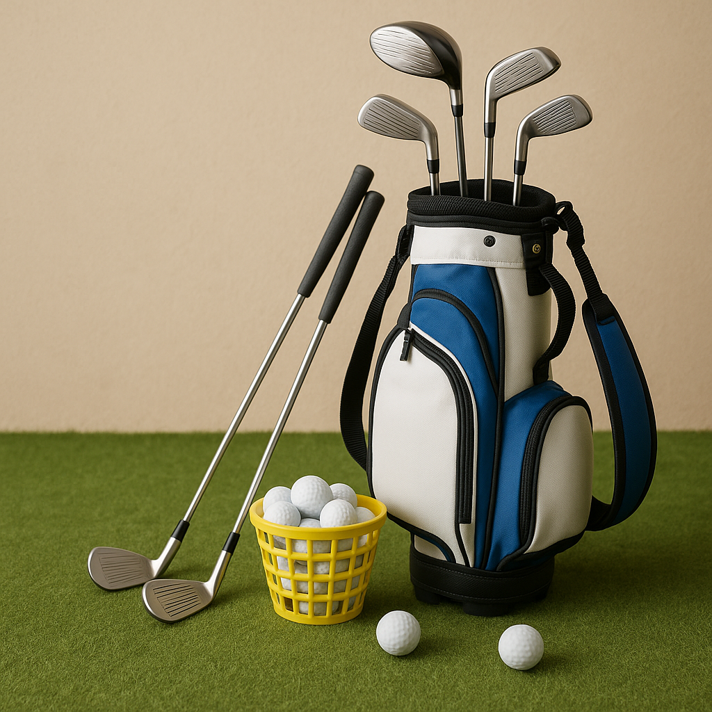

# Quick check

As you continue your golfing journey, it’s important to reflect on what you’ve learned so far. This page is designed to help both you and your parents ensure that you’re on the right track. Here are some key points to consider:

### Skills and Techniques to Review
- **Grip**: Make sure you’re holding the club correctly. Your grip should be firm but relaxed, allowing for maximum control.
- **Stance**: Check your positioning. Feet shoulder-width apart and knees slightly bent help maintain balance.
- **Swing Basics**: Have you practised your full swing and follow-through? Aim for fluid motion rather than sheer power.

### Course Etiquette
Understanding etiquette is just as crucial as mastering technique. Here are a few basics:
- **Be Respectful**: Keep quiet while others are taking their shots.
- **Keep Pace**: Always be aware of the group behind you and play at a steady pace.
- **Repair the Course**: Fill in divots, rake bunkers, and repair ball marks on the greens.

### Safety First
- **Look Out for Others**: Always check your surroundings before taking a swing.
- **Proper Gear**: Ensure you wear suitable clothing and footwear. A hat and sunscreen on sunny days are advisable.

### Self-Reflection
Take a moment to think about your experiences so far:
- What do you enjoy most about golf?
- What areas do you feel you need to improve? 
- How can your parents support you better?

### Next Steps
Now that you've had a quick check, it’s time to put this knowledge into action. Keep practising these skills, and don’t hesitate to ask your coaches or teammates for advice. Remember, learning should be fun, and just like any sport, everyone progresses at their own pace. 

Keep pushing forward, and enjoy every moment on the course!
