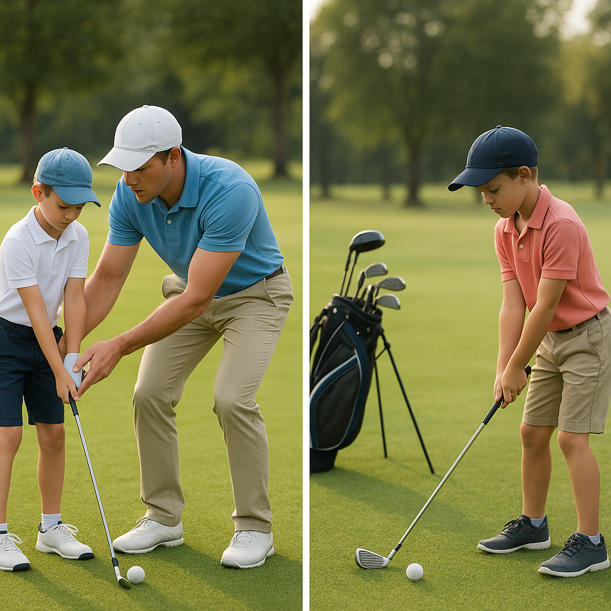

# Supporting Through Change

As young golfers grow and develop their skills, it’s natural for their motivation to ebb and flow. Recognising and supporting these changes can make a significant difference in their enjoyment and progression in the sport. Here are some strategies to help navigate these shifts positively:

### 1. **Encourage Open Communication**
Create an environment where young golfers feel comfortable expressing their feelings about the game. Ask them about what they enjoy and what feels challenging. Listening without judgement can help them articulate their thoughts and may reveal new interests or concerns.

### 2. **Set Realistic Goals**
Setting achievable, short-term goals can reignite excitement. Help your junior golfer identify what they want to improve, whether it’s mastering a specific technique or enhancing their game strategy. Celebrate small victories along the way to keep motivation high.

### 3. **Introduce Variety**
Sometimes, a change of pace can stimulate enthusiasm. Incorporate different activities related to golf, such as fun drills, mini-tournaments with friends, or even golf-themed games. This can provide a fresh perspective and make practice feel less routine.

### 4. **Highlight the Fun**
Remind them of the enjoyable aspects of golf. Organise social playdates with fellow young golfers or family outings to the driving range. Emphasise that golf is not just about competition but also about making memories and enjoying time outdoors.

### 5. **Be Patient and Understanding**
Motivation will vary from day to day. It’s essential to encourage perseverance while also respecting their feelings. If your golfer seems disinterested, let them take a break. Sometimes, stepping away can reignite passion and curiosity.

### 6. **Seek Inspiration**
Share stories of notable golfers and their journeys, especially those who have faced challenges. Books, videos, or even interviews can provide relatable experiences that inspire your junior golfer. 

By being supportive and understanding during times of change, you can help your junior golfer maintain their enthusiasm for the game and nurture a lifelong love for golf. Remember, every golfer's journey is unique, and following along with an open heart will only enrich their experience.
