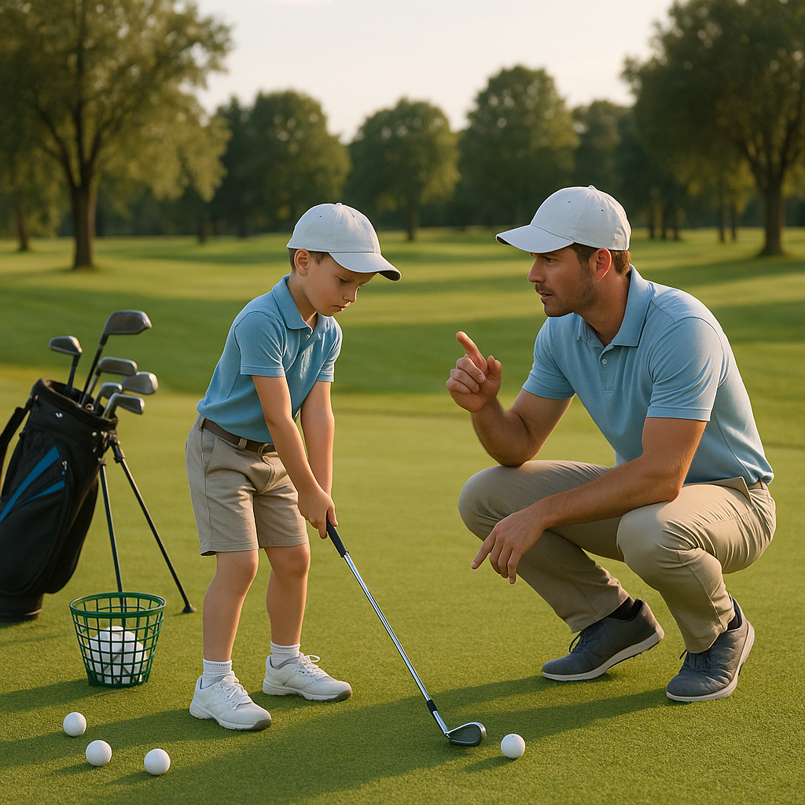

# Supporting, not steering

As your budding golfer embarks on their journey, it’s crucial for you, as a parent, to strike the right balance between guidance and independence. Your support can empower them to explore the game while fostering resilience and self-confidence.

### Encouragement over Instruction

Instead of giving constant technical advice, focus on offering encouragement. Celebrate their successes, no matter how small, and provide reassurance during moments of frustration. Positive reinforcement helps them develop a love for the game, making it more enjoyable and less about perfection.

### Create a Safe Space

Offer a supportive environment where questions and mistakes are welcomed. Encourage your child to express their thoughts about the game, whether they’re excited about a great shot or confused by a difficult hole. This open dialogue promotes learning and allows them to process their experiences without the pressure of judgement.

### Let Them Make Decisions

Rather than steering them on every course choice, allow your junior golfer to make decisions regarding their play. Encourage them to assess the course and choose their own clubs, shots, and strategies. This will cultivate critical thinking and instil a sense of ownership over their game.

### Be a Role Model

Your attitude and behaviour on the course greatly influence your child’s experience. Demonstrate good sportsmanship, patience, and a love for the game. Show them how to manage both success and setbacks gracefully; these life lessons extend beyond golf.

### Practise Together

Spend time together on the driving range or putting green. These sessions can be less formal than a round of golf and provide an excellent opportunity for bonding. While playing, focus on fun and skill development, allowing your child to learn at their own pace.

### Stay Informed

Familiarise yourself with the basics of the game, such as the rules and etiquette of golf. Your understanding will help you support your child better and make their experience more enjoyable. The more you know, the better equipped you’ll be to guide them through their learning process without overshadowing their natural curiosity.

By adopting a supportive rather than directive role, you help nurture a generation of confident, passionate players. Your encouragement can turn golf into a lifelong love, complete with skills and memories to cherish for years to come.
