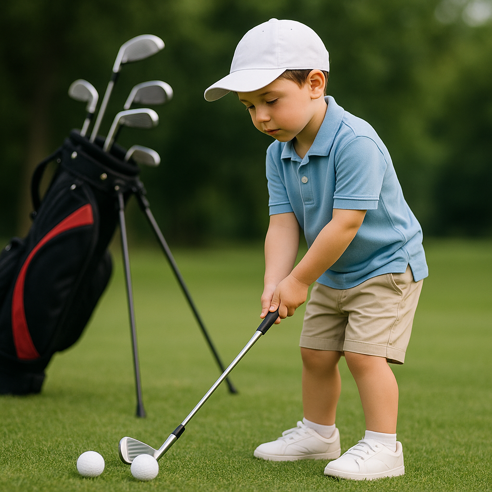

# What to Avoid

As budding junior golfers set foot on the course, it's essential for parents to know what behaviours and attitudes can hinder a positive learning experience. Here are some key points to keep in mind:

### Over-instructing

While your guidance is invaluable, avoid giving excessive advice during play. Constant corrections can overwhelm young golfers and take away the enjoyment of the game. Instead, encourage them to make decisions and learn from their experiences.

### Critiquing Poor Shots

Every golfer, no matter their age or skill level, will face challenges. Rather than focusing on mistakes or poor shots, highlight their efforts and improvements. Offer support and positivity to help them maintain motivation and confidence.

### Comparisons with Others

Each child develops at their own pace. Avoid comparing your junior golfer’s performance with that of peers or siblings. This can lead to frustration and feelings of inadequacy. Celebrate their individual progress instead.

### Pressuring to Compete

Golf is about personal growth, not just competition. Avoid placing too much emphasis on winning events or tournaments. Encourage participation for fun and the love of the game, emphasising the value of improvement over immediate results.

### Neglecting the Atmosphere

The golf course should be a fun environment. Avoid creating a tense atmosphere by voicing frustration or disappointment. A relaxed, cheerful attitude will help your junior golfer enjoy their time on the course, fostering a lifelong love for the sport.

### Ignoring the Spirit of Golf

Golf has a rich tradition and etiquette that contributes to its charm. Avoid dismissing the importance of manners, respect for fellow players, and care for the course. Instilling these values early on will help your golfer develop good habits for years to come.

### Too Much Focus on Equipment

While having the right equipment can be beneficial, avoid the temptation to concentrate solely on brand names or the latest gadgets. Emphasise the importance of practice and fundamentals over fancy gear.

By steering clear of these pitfalls, you can help create an atmosphere where your junior golfer thrives, enjoying the game while developing lifelong skills both on and off the course.
