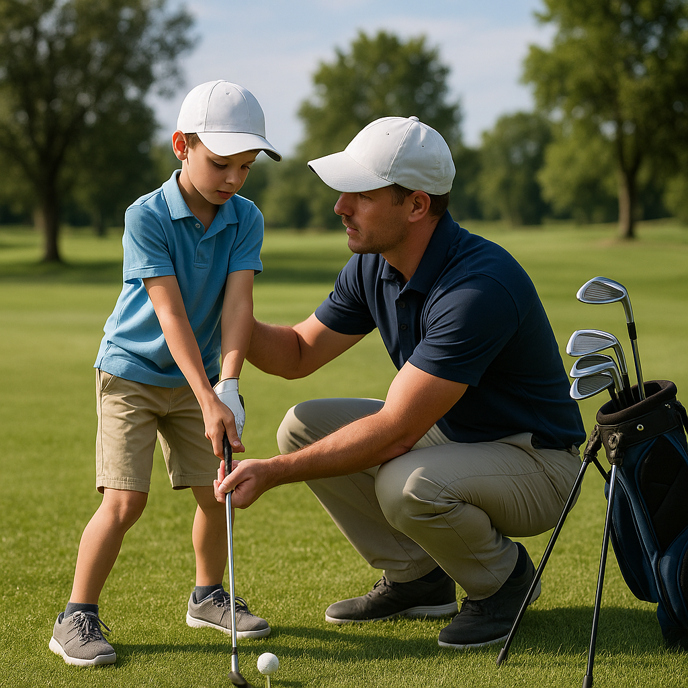

# Taking the Long-Term View

As your young golfer embarks on their journey on the course, it’s essential to maintain a long-term perspective. Golf is a unique sport that requires patience and commitment, and as a parent, your support during this phase can make all the difference.

## Focus on Enjoyment

Encourage your junior golfer to relish each moment spent on the course. Enjoyment fosters a lifelong love for the game. Celebrate small victories, whether it’s mastering a new swing or simply spending quality time outside. 

## Growth over Scores

While it’s natural to keep track of scores, shifting the focus from immediate results to personal development is vital. Emphasise skill enhancement over performance. Engage in conversations about what they learned during each round rather than just the final score. 

## Set Realistic Goals

Help your young golfer set achievable, short-term goals. These should align with their current abilities while still challenging them. Goals can range from improving a specific aspect of their game to simply enjoying more time on the course. Celebrate reaching these milestones to build confidence and motivation.

## Encourage Resilience

Golf teaches resilience; not every shot will be perfect, and there will be ups and downs along the way. Teach your junior golfer how to bounce back from setbacks. Reinforce that every challenge is an opportunity to learn, and instil a growth mindset by highlighting famous golfers who overcame adversity.

## Time for Reflection

Encourage your junior golfer to reflect on their experiences. After a round, spend a few moments discussing what they enjoyed or what they found challenging. This reflection can strengthen their understanding of their own game and foster emotional maturity.

By adopting a long-term view, you are cultivating not just a golfer but an individual who embraces the values of patience, resilience, and enjoyment. Keep nurturing this perspective, and your junior golfer will thrive both on and off the course.
