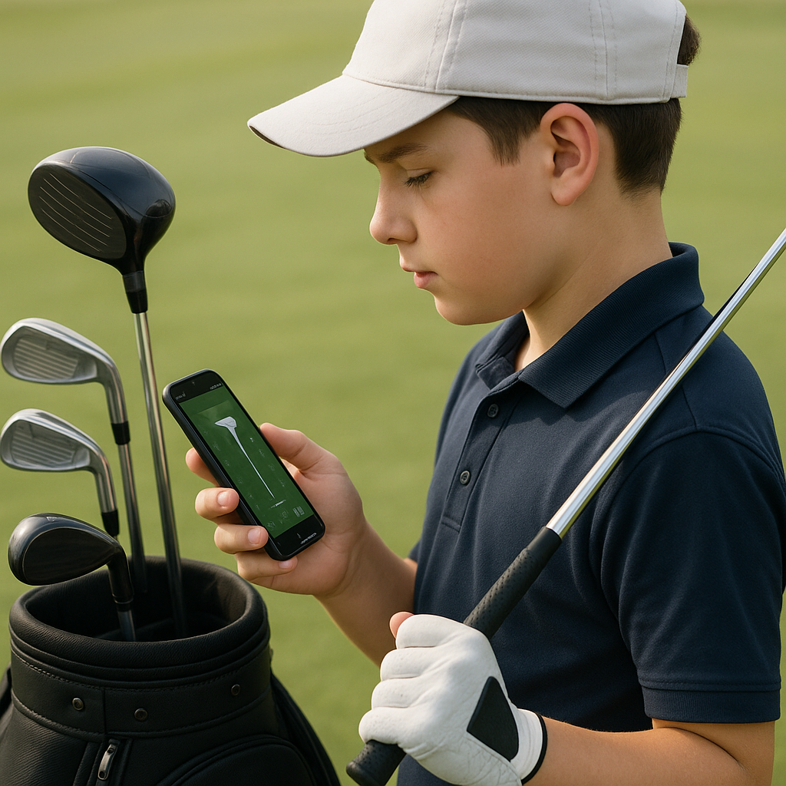

# Boundaries and Appropriate Behaviour

In golf, just like in other sports, understanding boundaries and showing appropriate behaviour are essential. These guidelines help everyone enjoy the game while feeling safe and respected. Here’s what every junior golfer should know:

## Personal Space

- **Respecting Others’ Space:** When practicing or playing, it's crucial to give fellow players enough room. Standing too close can be distracting and uncomfortable.

- **Physical Contact:** Avoid unnecessary touching. A friendly fist bump or high-five is great after a good shot, but always ask before giving a hug or any physical encouragement.

## Communication

- **Positive Interaction:** Use kind and encouraging words when speaking to teammates and coaches. Compliments nurture confidence and promote a supportive environment.

- **Listening Skills:** Good communication also includes listening. Pay attention to advice from coaches and feedback from more experienced players.

## Knowing Your Limits

- **Understanding Boundaries:** Each player has their own comfort levels. If someone seems uncomfortable with a joke or a comment, it’s essential to recognise that and change the topic or approach.

- **When to Step Back:** If you’re unsure whether something is appropriate, it’s always best to err on the side of caution. Respectful behaviour goes hand in hand with being a good player.

## Codes of Conduct

- **Following the Rules:** Every golf club has a code of conduct that outlines expected behaviours. Familiarise yourself with these rules and adhere to them.

- **Setting an Example:** As a junior golfer, you’re an ambassador for your club. Show good sportsmanship and respect to others, and you’ll inspire those around you.

Understanding boundaries and appropriate behaviour is crucial to creating a welcoming environment for everyone on the golf course. Let’s embrace these principles and continue our journey in this exciting sport!
