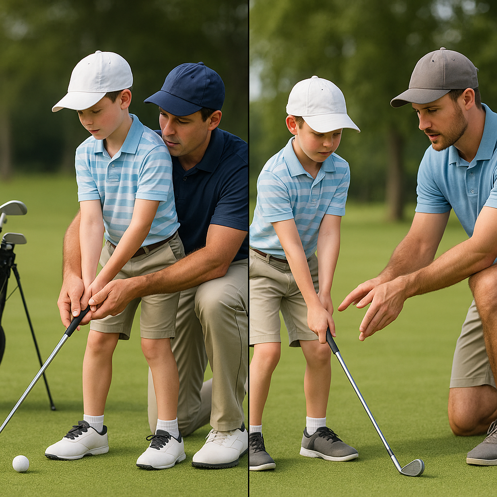

# Speaking up

In the world of golf and sports, feeling safe and secure is just as important as honing your skills with the club. Encouraging junior golfers to speak up is vital in creating a positive experience. Here are some key points to help you understand the importance of communication:

### 1. **Recognising Discomfort**
If at any time a junior golfer feels uncomfortable—whether due to the behaviour of others, situations, or feelings—it's important to recognise those feelings. Understanding that it’s okay to feel uneasy is the first step in speaking up.

### 2. **Finding the Right Person**
Encourage your child to speak to someone they trust, whether that’s a coach, a parent, or a friend. Having a reliable figure can make a big difference in how comfortable they feel about sharing their thoughts.

### 3. **Expressing Concerns**
Teach juniors that it’s perfectly acceptable to express their concerns or discomfort. This could be done verbally or even through writing a note if they find it easier. The aim is to communicate and not keep feelings bottled up.

### 4. **The Power of Listening**
As parents and mentors, demonstrate the value of listening attentively. When a young golfer feels heard, it empowers them to be open about their worries. Create an open-door policy where they know they can speak freely without judgment.

### 5. **Practising Scenarios**
Practising what to say in different scenarios can help ease anxiety about speaking up. Role-playing various situations—like addressing a concern with a coach or a teammate—can be a fun exercise and prepare them for real-life conversations.

### 6. **Wrapping Up the Conversation**
Once the matter has been communicated, it’s important to review the situation together. Discuss what steps can be taken to resolve any issues and ensure that your child feels supported throughout the process.

### Remember:
Encouraging your child to speak up not only fosters their own safety and well-being but also contributes to a strong, supportive environment for all participants in the game. It’s all about creating a community where everyone feels valued and secure!
