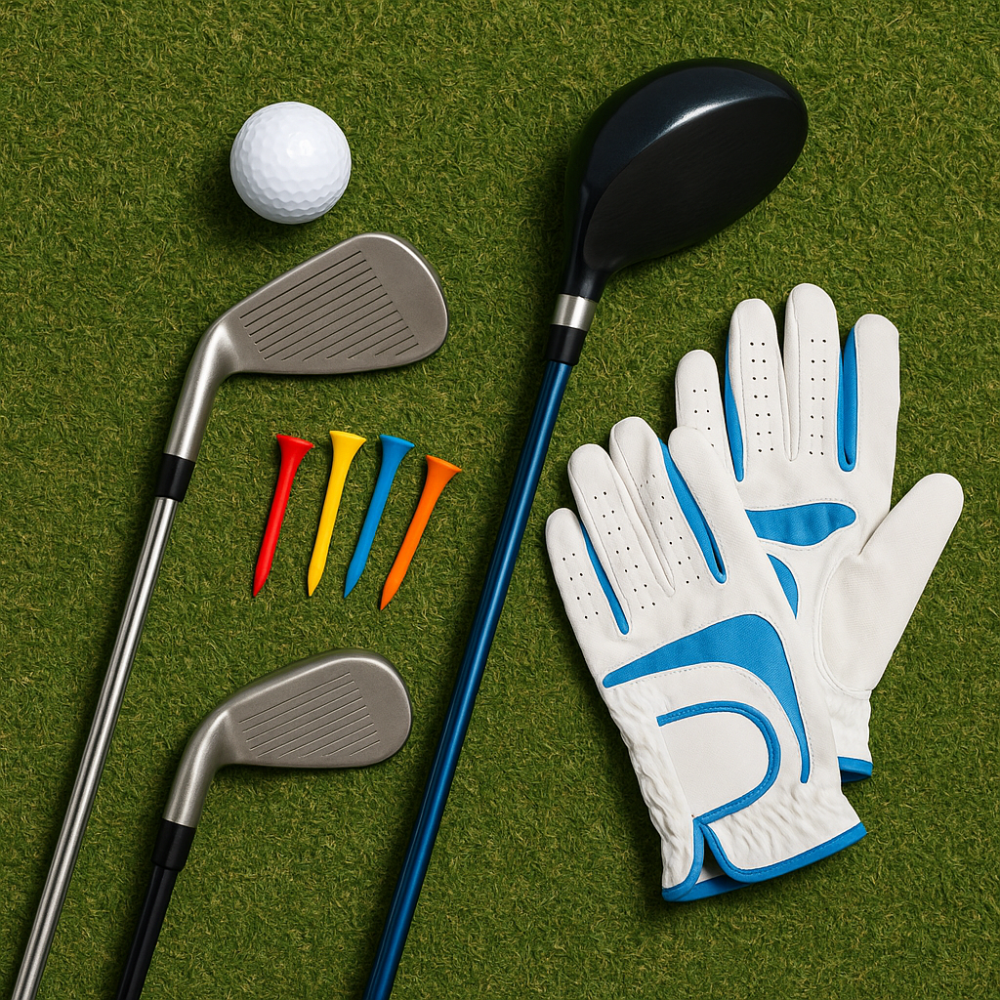

# Counting Strokes

Understanding how to count your strokes is a vital skill in golf. As you continue your journey, it’s essential to grasp this key aspect of the game. Let’s delve into how counting your strokes works during a round of golf.

### What are Strokes?

In golf, a ‘stroke’ refers to every swing you take at the golf ball. This can include putts, chips, and full swings. The objective is to complete each hole in as few strokes as possible.

### Keeping Track of Your Strokes

1. **Scorecard Basics**: When you play a round, you’ll use a scorecard. This card lists each hole along with its par—the average number of strokes a skilled golfer should take to complete the hole. Make sure to write down the number of strokes you take on each hole.

2. **Counting Your Strokes**: For each hole, add every stroke you take. This includes any penalty strokes you may incur (for example, if you hit your ball out of bounds and have to re-hit).

3. **Par and Your Score**: At the end of your round, add up the total number of strokes you took. Then, compare this number to the total par for the course. Your score can be expressed in relation to par – for instance, if you took 5 strokes on a par 4 hole, you score +1 for that hole.

### Example

- **Hole**: Par 3  
- **Strokes Taken**: 4  
- **Score**: +1 (because you took one more stroke than the par)

### Why Counting Matters

Counting strokes helps you understand your progress as a golfer. It can highlight areas where you can improve, like putting or driving. Keeping an accurate score not only makes the game more enjoyable but also prepares you for friendly competitions in the future.

### Additional Tips

- **Practice Counting**: When you’re on the course, practice counting your strokes out loud. This will help you remember the process.
- **Be Honest**: Always count every stroke. Integrity is a crucial part of the game and helps build trust on the course.

As you get ready for your first rounds, ensuring you can accurately count and record your strokes will contribute significantly to your golfing experience and enjoyment. Keep practicing, and soon, you’ll feel confident in your scoring! 

In the next section, we will explore what competitions look like in junior golf, and how you can get involved.
