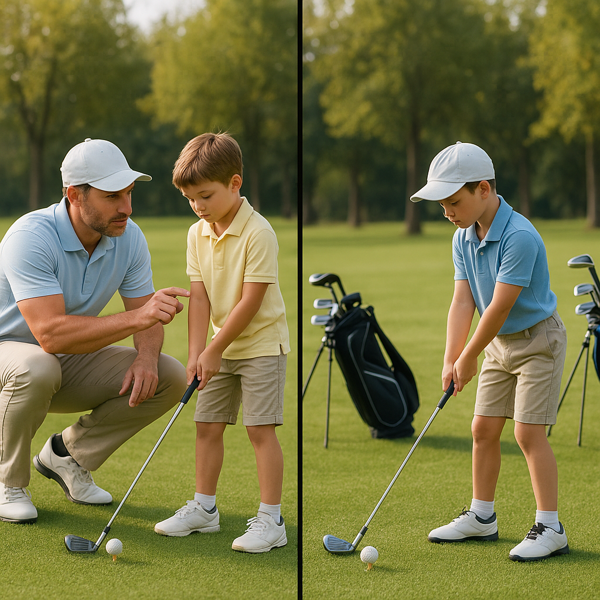

# Junior Competitions

Competing in junior golf is an exciting opportunity to apply everything you’ve learned so far and meet other young golfers. Participating in competitions can boost your skills and confidence, making golf even more enjoyable!

## Types of Junior Competitions

1. **Local Tournaments**: These events are often organised by golf clubs in your area. They typically feature different age categories, ensuring that every participant competes against players of a similar skill level.

2. **Club Championships**: Many golf clubs host annual championships where juniors can compete for titles. These competitions can be quite prestigious, allowing you to gain recognition in your club.

3. **Team Events**: Some competitions are structured in teams, where you can work alongside your friends or clubmates. Team events encourage camaraderie and teamwork, making them a fun way to engage with the sport.

4. **Open Competitions**: These are open to players from various clubs. They usually attract a larger field and may offer a more competitive atmosphere, helping you gauge your abilities against a wider range of players.

## Preparing for a Competition

- **Practice**: Focus on areas you feel less confident in, whether it’s your driving, chipping, or putting. Consistent practice will help you feel prepared.

- **Know the Course**: If possible, visit the course beforehand to familiarise yourself with its layout. Understanding where to place your shots can be a significant advantage during a competition.

- **Stay Positive**: Competitions can be nerve-wracking, but maintaining a positive mindset is crucial. Remember, each event is a chance to learn and have fun.

## The Day of the Competition

- **Arrive Early**: Give yourself plenty of time to warm up and get into the right headspace. Rushing can lead to unnecessary stress.

- **Dress Code**: Make sure you adhere to the dress code of the event. Wearing appropriate golf attire is not only respectful but also helps you feel confident.

- **Stay Hydrated and Nourished**: Bring snacks and water to keep your energy levels up throughout the day.

## Key Takeaway

Competing is a natural part of your golfing journey. Each experience will teach you valuable lessons, whether you win or not. Embrace the spirit of competition, focus on having fun, and enjoy the wonderful world of golf!
