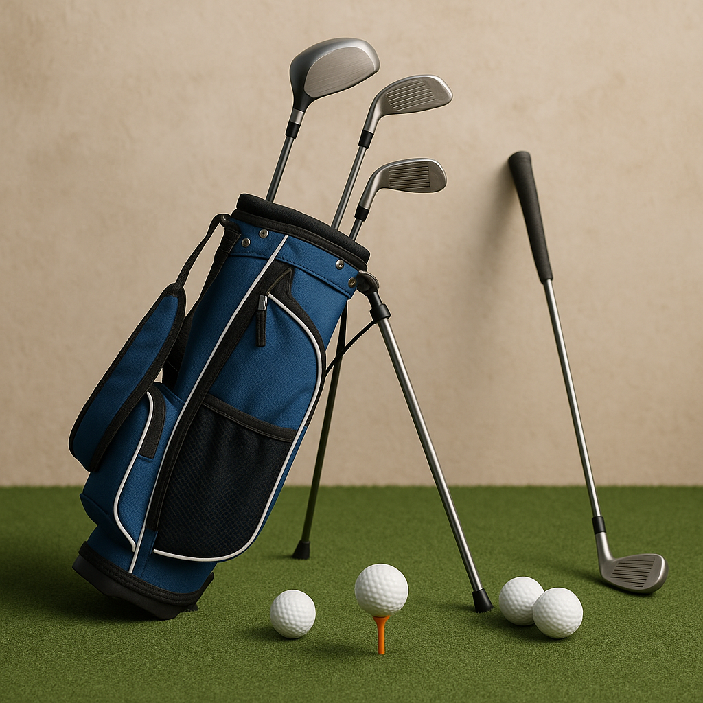

# Quick Check

As you continue your journey into the world of golf, it’s important to reinforce what you've learned so far. This quick check will help you review key concepts and ensure you’re feeling confident with your skills.

### Scoring Basics

1. **What is the aim of scoring in golf?**
   - a) To have the highest number of strokes
   - b) To have the lowest number of strokes
   - c) To finish first in a race

2. **When do you record your score on the scorecard?**  
   - a) Before starting the hole  
   - b) After finishing the hole  
   - c) At the end of the game  

### Counting Strokes

3. **How do you count your strokes on a hole?**  
   - a) Only count the putts  
   - b) Count every stroke made, including penalties  
   - c) Only count the drive from the tee  

### Using a Scorecard

4. **What information should you fill out on a scorecard?**  
   - a) Your score and the course's par  
   - b) Only your score  
   - c) The weather conditions  

### Junior Competitions

5. **What are junior competitions designed to encourage?**  
   - a) Winning at all costs  
   - b) Fun and learning amongst young players  
   - c) Adults to participate only  

### Stableford Scoring

6. **In Stableford scoring, what do you earn points for?**  
   - a) The number of strokes you take  
   - b) The number of holes won  
   - c) Scoring below par on a hole  

### Reflection

Now that you’ve completed the quick check, take a moment to reflect on your answers. Discuss them with your parent or coach to clarify any concepts you’re unsure about. This dialogue will enhance your understanding and help you become a more confident golfer.

---

Next up, we’ll explore how to translate your skills into practice on the course! Keep aiming for improvement and enjoy every shot!
