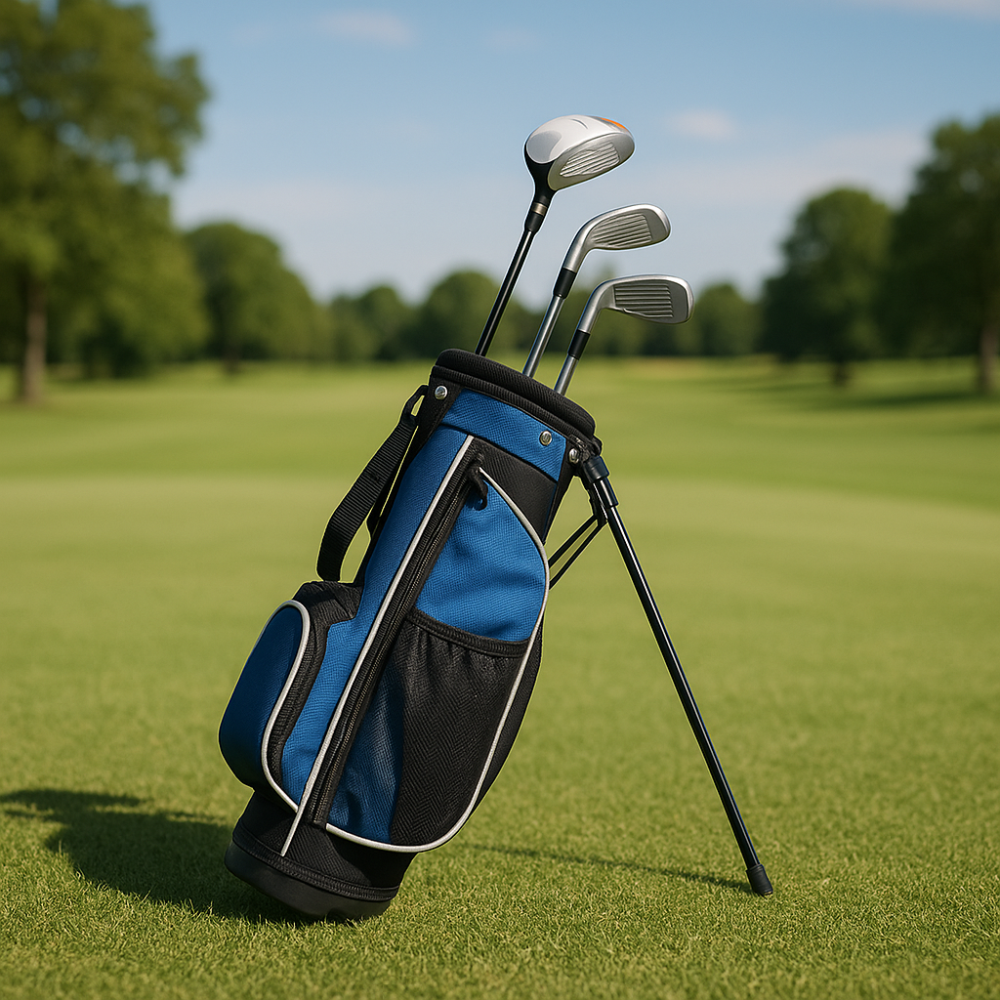

# A Simple Guide

Congratulations on embarking on your journey into the exciting world of golf! As you step onto the course, it’s important to understand your equipment—most importantly, your golf bag. Here’s a straightforward overview of what you might find inside, along with some tips on how to use them.

## The Essentials in Your Bag

1. **Golf Clubs**  
   Most junior golfers will carry a selection of clubs. Here’s a quick rundown of the basic types you’ll likely have:

   - **Driver**: The longest club, perfect for teeing off. Use it to hit the ball as far as possible down the fairway.
   - **Irons**: These clubs have shorter shafts and are used for a variety of shots, typically from the fairway or rough. The higher the number, the shorter the club (e.g., 7-iron is shorter than a 5-iron).
   - **Wedges**: These are special irons designed for short, precise shots around the green. They include pitching wedges and sand wedges.
   - **Putter**: Used on the green to roll the ball into the hole. It’s crucial to practice your putting skills!

2. **Golf Balls**  
   Each player should carry a few golf balls in their bag. As a beginner, don’t worry if you lose a few; it’s all part of the learning process!

3. **Tees**  
   These small, pegs hold the ball up for your first shot on the tee box. Tees come in different heights; make sure to adjust depending on the club you’re using.

4. **Golf Glove**  
   Wearing a glove can improve your grip on the club, especially when it’s wet or sweaty. It typically goes on your non-dominant hand.

5. **Ball Marker**  
   This small disc is handy for marking the position of your ball on the green. It helps you lift your ball without losing your spot.

6. **Towel**  
   Keeping your clubs and balls clean is essential. A towel helps you wipe off dirt or moisture to maintain a good grip and performance.

7. **Rangefinder or Scorecard**  
   While you’re learning, it’s a good idea to use a scorecard to track your progress. A rangefinder helps you gauge distances on the course.

## Tips for Packing Your Bag

- **Keep it Neat**: Organise your clubs by type, with the driver at the top and the putter at the bottom. This makes it easier to find what you need during play.
- **Check Your Gear**: Before hitting the course, always make sure your bag is stocked with enough balls, tees, and other essentials.
- **Stay Hydrated**: Include a water bottle to keep yourself refreshed while you play.

Understanding your bag is the first step in becoming a confident young golfer. With practice and familiarity, you'll soon feel right at home on the course! Get ready to explore the next chapter of your golf adventure.
