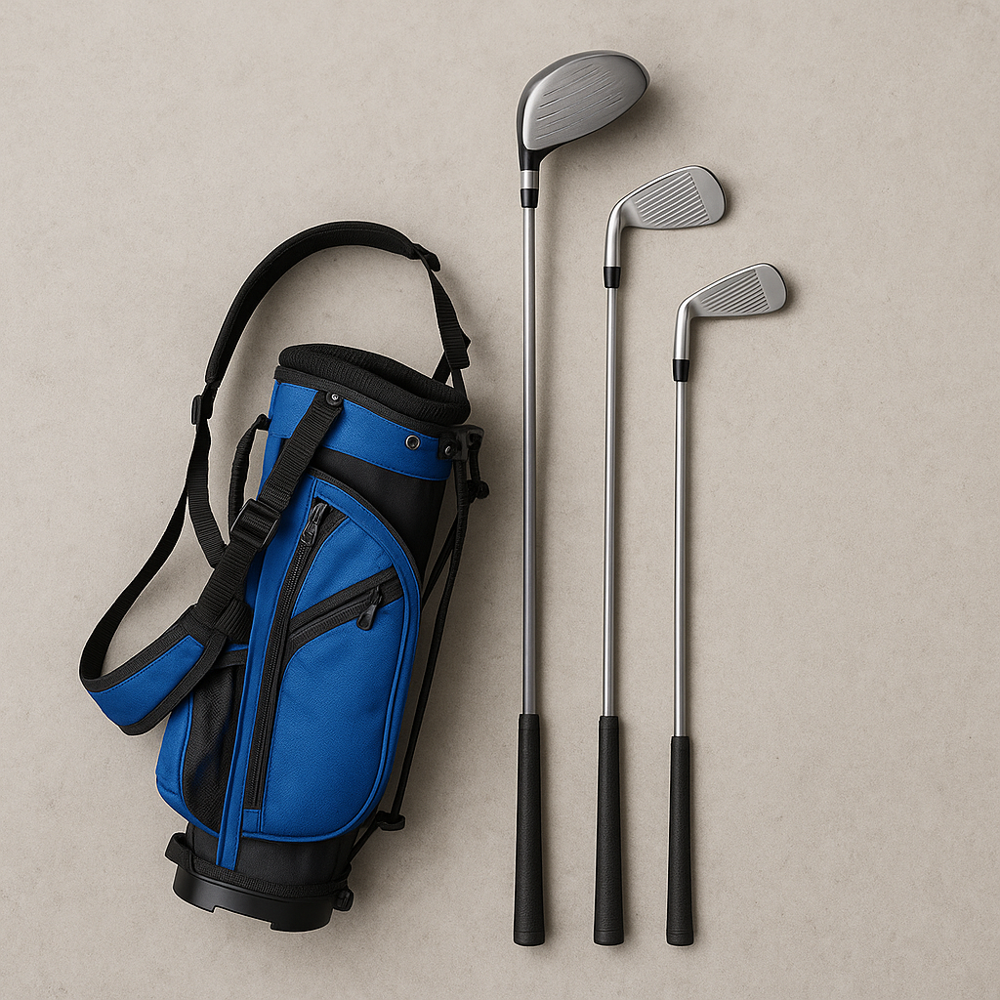

# Clubs in a Golf Bag

Understanding what’s in your golf bag is key to becoming a more confident golfer. Let’s explore the different types of clubs you might find in your bag, each with its own purpose.

### 1. Woods
- **Driver:** The longest club in your bag, designed for hitting the ball off the tee on the first stroke. It’s great for covering long distances.
- **Fairway Woods:** These clubs are slightly shorter than the driver and are used for long shots from the fairway, helping you get closer to the green.

### 2. Irons
Irons come in numbers ranging from 3 to 9, with each number representing a different loft and distance.
- **Short Irons (8 & 9):** Ideal for shorter, more accurate shots, especially when you are close to the green.
- **Mid Irons (5 to 7):** Versatile clubs used for various distances, helping you navigate tricky spots on the course.
- **Long Irons (3 & 4):** Great for longer shots, though they require more skill to hit effectively.

### 3. Wedges
These specialised irons are designed for short shots around the green. They help you pitch and chip effectively.
- **Pitching Wedge:** Perfect for tackling distances up to 100 yards, using it for approach shots is common.
- **Sand Wedge:** Especially helpful in escaping bunkers, it has a wider sole to glide through sand.
- **Lob Wedge:** Used for high, short shots over obstacles like bunkers, providing a soft landing on the green.

### 4. Putter
The most crucial club for scoring, the putter is used on the greens to roll the ball into the hole. There are various styles of putters, so finding one that feels comfortable is key.

### Tips for Young Golfers:
- **Practice with Each Club:** Spend time in practice sessions to get familiar with how each club feels and responds.
- **Ask for Help:** Don’t hesitate to ask a coach or an experienced player about any club you’re unsure about.

Understanding your clubs not only enhances your skills but also makes your golfing experience more enjoyable. Explore the functions of each and see how they can help you on the course!
