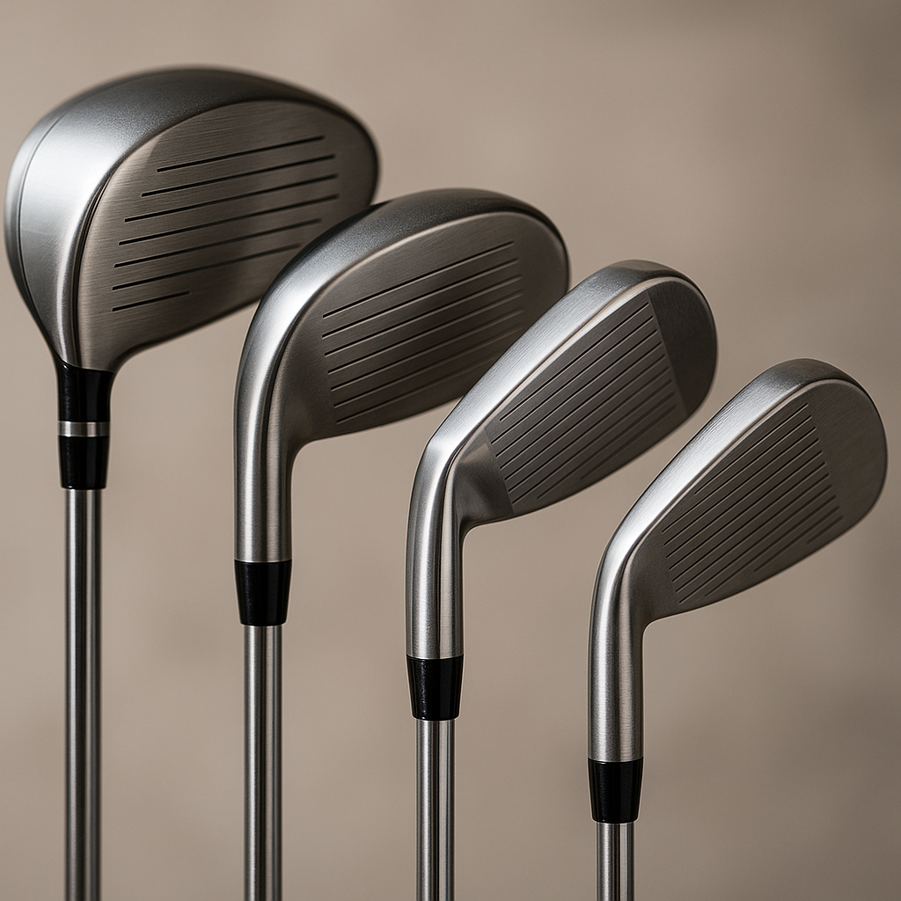

# Woods, Irons and Hybrids

Now that you know about the different clubs in your golf bag, let's take a closer look at three important types: Woods, Irons, and Hybrids. Each of these clubs has a unique purpose and will help you on the course.

## Woods
Woods are generally used for longer shots, especially from the tee or fairway. The driver, which is the largest wood, is designed to hit the golf ball the farthest. Here are some key features:

- **Large Clubhead**: This helps produce high speeds and long distances.
- **Low Loft**: This means the clubface angle is shallower, which allows for a longer ball flight.

When using a wood, aim for smooth, controlled swings to maximise distance.

## Irons
Irons are numbered, typically ranging from 3 to 9, with lower numbers meant for longer shots and higher numbers for shorter approach shots. Key points to remember:

- **Versatile**: You can use irons on the fairway, rough, or for short distance chips.
- **Angle**: They have more loft than woods, which helps get the ball airborne quickly.

Practice your stance and grip; this will greatly influence your accuracy with irons.

## Hybrids
Hybrids combine features of both woods and irons, making them a favourite for many golfers, especially beginners. They are designed for versatility and ease of use:

- **Easy to Hit**: Their design helps reduce the likelihood of hitting poor shots, making them great for various lies.
- **Crossover Utility**: Hybrids can replace long irons, offering a balance of distance and control.

Consider adding a hybrid to your bag if you’re still getting comfortable with hitting long irons.

## Tips for Practice
1. **Experiment**: Spend time on the driving range hitting each type of club to understand their differences.
2. **Focus on Technique**: Work on proper grip and stance for each club to improve your consistency.
3. **Course Application**: Try using each club during games, noting which situations they work best in.

Understanding these clubs will greatly enhance your enjoyment and performance on the course. Remember to have fun while you learn, and don’t be afraid to ask for help from your coach or more experienced players!
