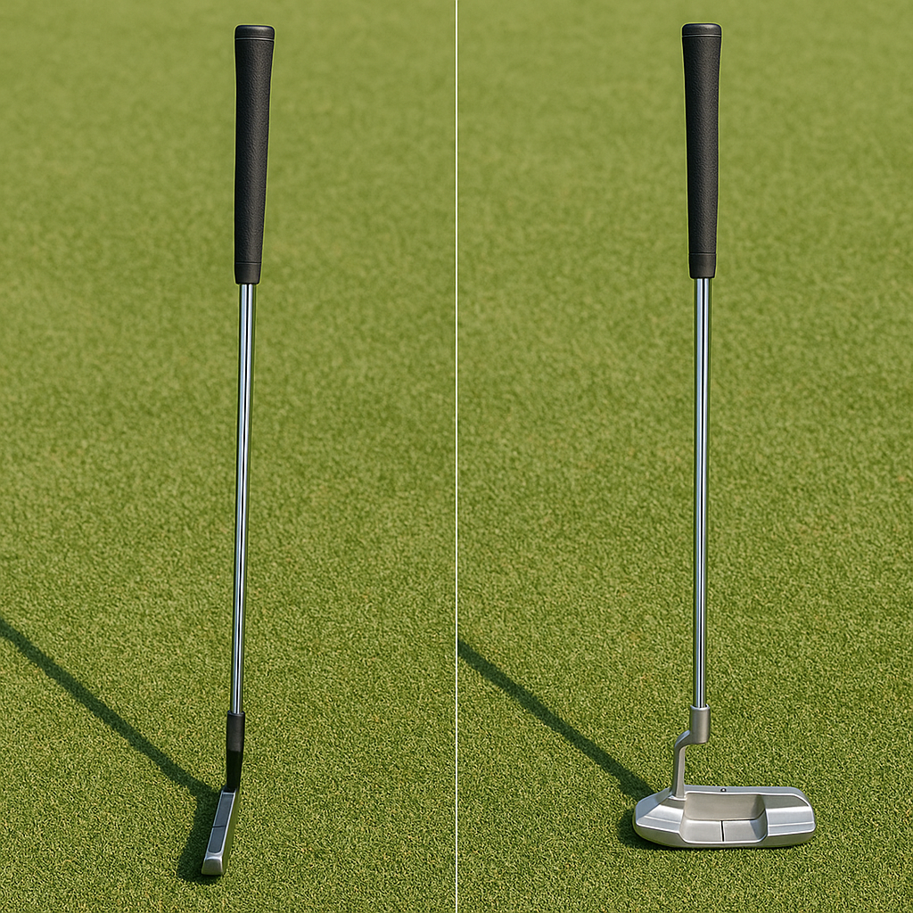

# Wedges and Putter

In your golf bag, wedges and a putter are essential clubs, each serving a unique purpose that can dramatically enhance your game. Let's explore how they work!

## Wedges

Wedges are specialised types of irons designed for short-distance shots around the green and for getting out of tricky situations. There are three main types of wedges:

1. **Pitching Wedge (PW)**: This club is great for both approach shots and when you need to get the ball airborne quickly. It typically has a loft between 44° and 48°.

2. **Sand Wedge (SW)**: The sand wedge is primarily used for bunkers or sandy spots. With a loft of around 54° to 58°, it helps you lift the ball out of tricky lies.

3. **Lob Wedge (LW)**: This club has the highest loft (usually between 58° and 64°). It’s perfect for those delicate shots when you need the ball to stop quickly on the green.

### Tips for Using Wedges
- **Open the Face**: For better loft, you can open the clubface slightly. Just be mindful that this requires a different swing.
- **Aim for the Right Distance**: Each wedge has a different range. Practise to know how far you can hit with each one.
  
## Putter

The putter is a unique club designed specifically for use on the green. Its main purpose is to roll the ball into the hole, making it a vital instrument for scoring. Here are some things to consider:

### Types of Putters
- **Blade Putters**: These have a simple design and are often preferred by more experienced players for their feel.
- **Mallet Putters**: These have a larger, more forgiving head, making them a popular choice for beginners.

### Tips for Putting
- **Grip**: Hold the putter with a light grip, allowing for better feel and control.
- **Stance**: Position your feet shoulder-width apart, keeping your weight balanced.
- **Focus on the Line**: Always aim for your target! Visualise the path the ball needs to take to reach the hole.

### Practise Makes Perfect
Take time to practise with your wedges and putter. Set up a few short challenges, such as chipping balls into a target or seeing how many puts it takes to complete a hole. The more you practise, the more confident you'll become!

By mastering the use of wedges and your putter, you'll become a more skilled player, ready to tackle any situation on the course. Keep up the great work, and enjoy your golfing journey!
