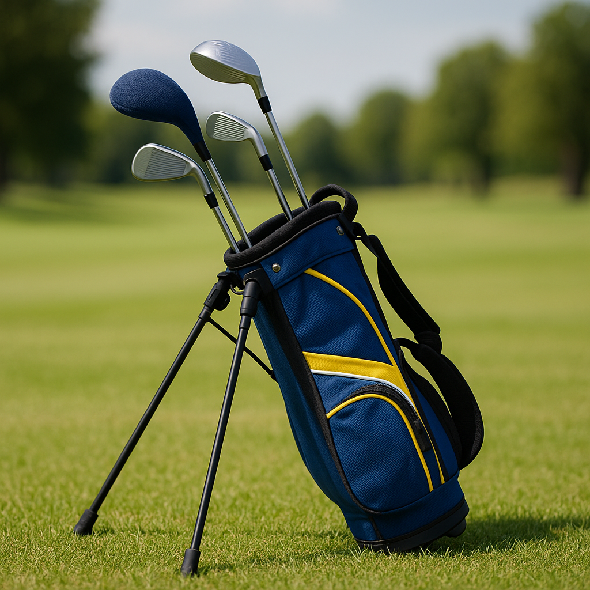

# Getting Fitted

Now that you’re familiar with the different clubs in your bag, it’s time to ensure they’re just right for you. Getting fitted for clubs is an important step that can enhance your performance and enjoyment of the game.

### Why Get Fitted?

Every golfer is unique, with different heights, swings, and styles. A proper fitting will help you find clubs that suit your body and playing style, leading to:

- **Improved Accuracy**: Clubs that match your specifications can help you hit straighter shots.
- **Increased Distance**: The right fit allows for optimal swing mechanics, helping you hit the ball further.
- **Enhanced Comfort**: Comfortable clubs can make your time on the course more enjoyable.

### What to Expect

When you go for a fitting, a professional will take various measurements and analyse your swing. Here are the key aspects they’ll consider:

1. **Height and Arm Length**: These measurements help determine the appropriate club length.
   
2. **Swing Speed**: Fittings usually involve measuring how fast you swing, which influences the type of shaft you need.
   
3. **Grip Size**: The right grip is vital for control. A fitter will evaluate your hand size to find the perfect fit.

4. **Swing Path and Angle**: Observing how you swing helps in selecting the right clubhead design and type of shaft.

### Where to Get Fitted

- **Local Pro Shops**: Many golf courses have professionals who can conduct fittings.
- **Specialist Golf Stores**: Look for stores that offer fitting services with a range of brands.
- **Mobile Fitters**: Some experts will come to you, providing fittings at your home course.

### After Your Fitting

Once fitted, it's essential to practise with your new clubs. Spend time at the driving range or practice putting greens to get accustomed to their feel and performance. 

Your equipment will now feel tailored to you, enhancing your skills and helping you enjoy the game even more. 

As you progress, remember that your golfing journey is unique, and fitting might need revisiting as you grow and develop. 

Are you ready to step onto the course with your new clubs? Let's continue this exciting adventure!
