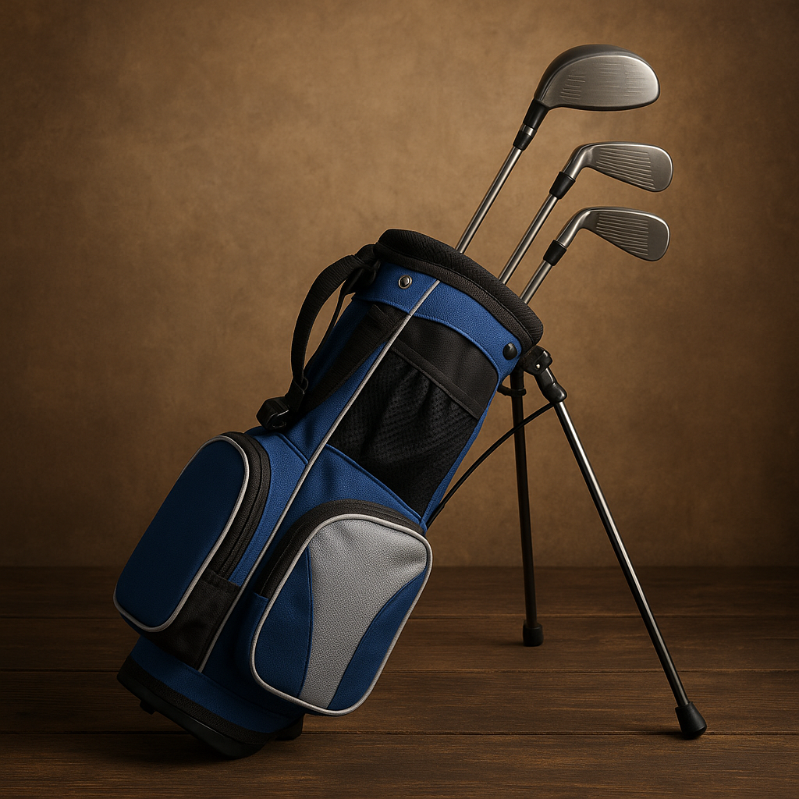

# Quick check

Now that you know the essentials about clubs and how to get properly fitted, it’s time to ensure you’re ready to hit the course. This quick check will help you confirm that you’re all set for your golfing adventures! 

### 1. Gear Checklist
- **Clubs:** Do you have all the necessary clubs in your bag?
- **Gloves:** Is your glove clean and comfortable?
- **Ball:** Do you have a few golf balls ready to go?
- **Tees:** Have you packed your tees for those all-important drives?
- **Shoes:** Are your shoes comfortable and suitable for the course?

### 2. Understand the Basics
- **Grip:** Is your grip comfortable? Remember to hold the club firmly but not too tight.
- **Stance:** Is your stance balanced? Feet should be shoulder-width apart.
- **Alignment:** Are you positioning your body towards your target?

### 3. Focus on Safety
- **Know the Rules:** Have you familiarised yourself with basic golf etiquette? This includes waiting your turn and being quiet when others are addressing their shots.
- **Course Safety:** Are you aware of your surroundings? Always look out for other players and maintain a safe distance when swinging.

### 4. Stay Hydrated
- Bring a water bottle! It’s easy to forget, but staying hydrated helps you focus and enjoy your game.

### 5. Practice Mindset
- **Have Fun:** Remember, golf is a game. Enjoy the time spent on the course, regardless of your score!
- **Set Goals:** Think about what you’d like to achieve today, whether it’s mastering a certain swing or just having fun with friends.

Once you've checked everything off the list, you’ll be well-prepared to tee off! On to your next adventure in golf, where it’s time to start playing and putting all this knowledge into practice.
