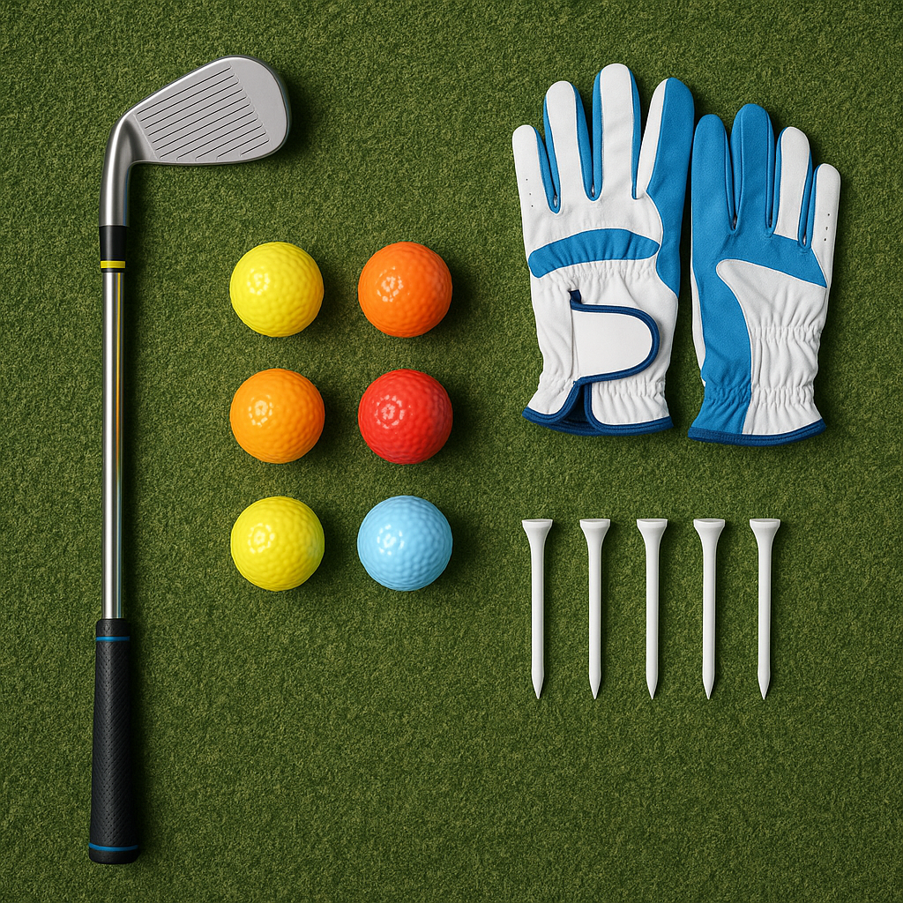

# Lost Balls

Losing a ball can be frustrating, especially for new golfers. It’s important to remember that everyone, including the professionals, faces this challenge. Here’s what you can do if you find yourself in this situation:

## 1. Stay Calm  
It’s easy to feel upset when you lose a ball. Take a deep breath and remind yourself that it’s part of the game. Golf is about enjoying the outdoors and having fun!

## 2. Look Carefully  
If you think you’ve lost a ball, try to retrace your steps. Keep an eye on the area where it went off the fairway or into the rough. Sometimes, it may be hiding in some long grass or behind a tree.

## 3. Consider the Rules  
If you can’t find your ball within three minutes, it’s time to move on. According to the rules of golf, you can take a ‘stroke and distance’ penalty. This means you’ll go back to where you last hit the ball and take another shot, adding a penalty stroke to your score.

## 4. Play Safe  
When you're on the course, choose a ball that’s not too special or expensive for practice rounds. This way, losing a ball becomes less stressful and won’t ruin your day.

## 5. Learn from Each Shot  
Each shot is a chance to improve. If you find yourself losing balls often, think about your technique. Are you aiming properly? Are you swinging too hard? Consider asking your coach for tips to keep the ball on the fairway.

## 6. Practise Your Aim  
Set up some targets when practising. Use cones, flags, or even hula hoops in your garden to help you focus on your aim. The more you practice, the fewer balls you'll lose on the course!

## 7. Enjoy the Journey  
Golf is about progression. Each time you play, you’ll learn something new, whether it's how to deal with loss or how to improve your swing. Remember to enjoy each round as part of your growth as a golfer.

Losing a ball isn't the end of the world. It’s an opportunity to learn and develop your skills. Keep playing, stay positive, and watch how you improve!
