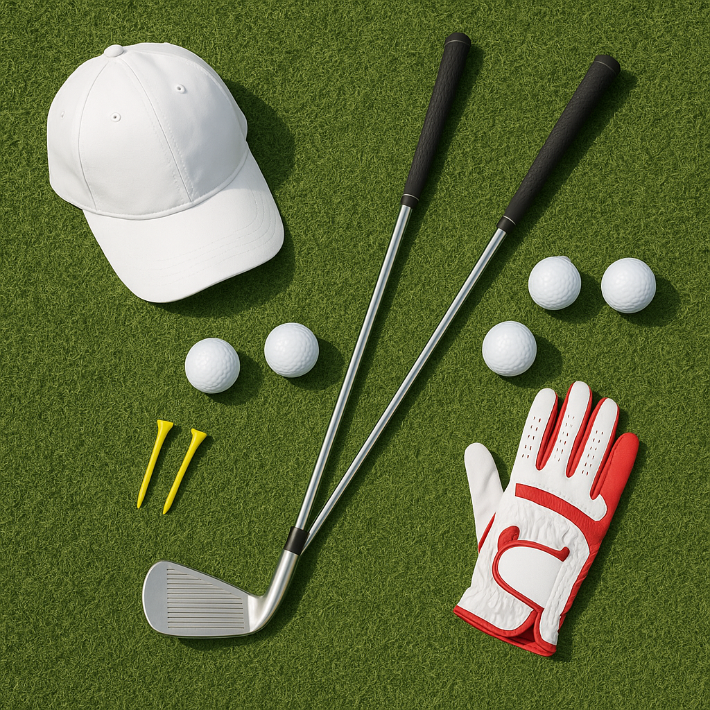

# Clothing and Equipment

As we venture into the winter months, it’s essential to ensure you’re properly equipped to enjoy your golfing experience, no matter the conditions. The right clothing and equipment can make a world of difference in your comfort and performance on the course. 

### Clothing Essentials

1. **Layer Up**: Dressing in layers helps you regulate your body temperature. Start with a moisture-wicking base layer to keep sweat away. Add a thermal mid-layer for warmth and finish with a windproof outer layer to protect against the elements.

2. **Waterproof Gear**: Rain can often arrive unexpectedly. Invest in a good quality waterproof jacket and trousers to keep dry. Look for options that are breathable to ensure you feel comfortable throughout your round.

3. **Accessories**:
   - **Hat or Beanie**: Warm your head and protect your eyes from the glare of the low winter sun. 
   - **Gloves**: A pair of insulated golf gloves can help maintain grip even in chilly conditions. Don't forget to take a spare pair in case they get wet!
   - **Warm Socks**: Choose thicker, moisture-wicking socks to keep your feet warm and dry.

### Footwear

Proper footwear is crucial during winter golf:
- **Golf Shoes**: Look for waterproof golf shoes or those with good traction to avoid slipping on wet grass.
- **Spikes**: If permitted on your course, consider wearing shoes with removable spikes for better grip on slippery terrain.

### Equipment Checks

1. **Clubs**: Inspect your clubs to ensure they are clean and free from rust. The ground can be damp, so store them in a dry environment after your game.
   
2. **Bags**: A waterproof golf bag can protect your clubs and equipment from rain. Many bags come with rain covers, which can be very useful during winter rounds.

3. **Balls**: Opt for balls that perform well in cooler temperatures. Some brands offer winter golf balls that are designed to retain distance and feel in cold conditions.

### Final Thoughts

Being properly dressed and equipped will help you focus on your game rather than the cold. Embrace the winter season and remember, every round played is a step towards becoming a better golfer. Now, let's move on to how to adjust your game for those chilly, wintery conditions!
